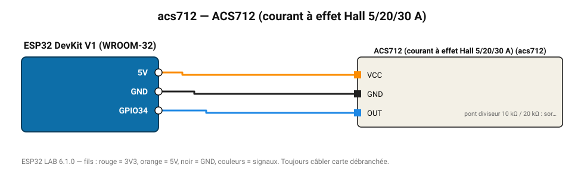

# ACS712 (courant à effet Hall 5/20/30 A)

Capteur de courant isolé AC/DC : 185 mV/A (5 A), 100 mV/A (20 A), 66 mV/A (30 A).

**Carte :** ESP32 DevKit V1 (WROOM-32) — moniteur série 115200 bauds.

| ESP32 | Composant | Broche | Couleur fil | Remarque |
|---|---|---|---|---|
| 5V (VIN) | ACS712 (courant à effet Hall 5/20/30 A) | VCC | orange |  |
| GND | ACS712 (courant à effet Hall 5/20/30 A) | GND | noir |  |
| GPIO34 | ACS712 (courant à effet Hall 5/20/30 A) | OUT | bleu | pont diviseur 10 kΩ / 20 kΩ : sortie 0-5 V centrée sur 2,5 V |

Toujours câbler **carte débranchée**. Masse (GND) commune entre tous les modules.
