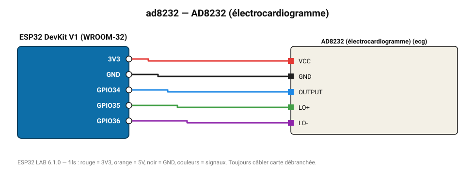

# AD8232 (électrocardiogramme)

Frontal ECG une dérivation : visualisez le tracé cardiaque dans le traceur série.

**Carte :** ESP32 DevKit V1 (WROOM-32) — moniteur série 115200 bauds.

| ESP32 | Composant | Broche | Couleur fil | Remarque |
|---|---|---|---|---|
| 3V3 | AD8232 (électrocardiogramme) | VCC | rouge |  |
| GND | AD8232 (électrocardiogramme) | GND | noir |  |
| GPIO34 | AD8232 (électrocardiogramme) | OUTPUT | bleu |  |
| GPIO35 | AD8232 (électrocardiogramme) | LO+ | vert |  |
| GPIO36 | AD8232 (électrocardiogramme) | LO- | violet |  |

Toujours câbler **carte débranchée**. Masse (GND) commune entre tous les modules.
