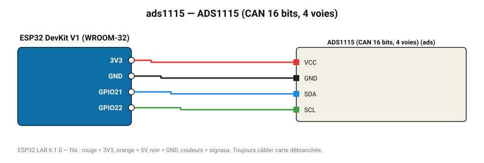

# ADS1115 (CAN 16 bits, 4 voies)

Convertisseur analogique-numérique 16 bits avec gain programmable : bien plus précis que l'ADC interne.

**Carte :** ESP32 DevKit V1 (WROOM-32) — moniteur série 115200 bauds.

| ESP32 | Composant | Broche | Couleur fil | Remarque |
|---|---|---|---|---|
| 3V3 | ADS1115 (CAN 16 bits, 4 voies) | VCC | rouge |  |
| GND | ADS1115 (CAN 16 bits, 4 voies) | GND | noir |  |
| GPIO21 | ADS1115 (CAN 16 bits, 4 voies) | SDA | bleu |  |
| GPIO22 | ADS1115 (CAN 16 bits, 4 voies) | SCL | vert |  |

Toujours câbler **carte débranchée**. Masse (GND) commune entre tous les modules.
