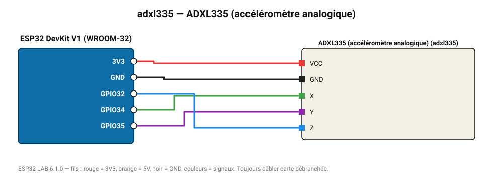

# ADXL335 (accéléromètre analogique)

Accéléromètre ±3 g à trois sorties analogiques (330 mV/g, zéro à 1,65 V).

**Carte :** ESP32 DevKit V1 (WROOM-32) — moniteur série 115200 bauds.

| ESP32 | Composant | Broche | Couleur fil | Remarque |
|---|---|---|---|---|
| 3V3 | ADXL335 (accéléromètre analogique) | VCC | rouge |  |
| GND | ADXL335 (accéléromètre analogique) | GND | noir |  |
| GPIO34 | ADXL335 (accéléromètre analogique) | X | vert |  |
| GPIO35 | ADXL335 (accéléromètre analogique) | Y | violet |  |
| GPIO32 | ADXL335 (accéléromètre analogique) | Z | bleu |  |

Toujours câbler **carte débranchée**. Masse (GND) commune entre tous les modules.
