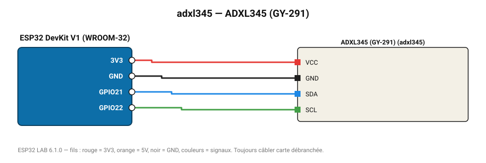

# ADXL345 (GY-291)

Accéléromètre 3 axes ±2 à ±16 g, détection de chute libre et de tapotement.

**Carte :** ESP32 DevKit V1 (WROOM-32) — moniteur série 115200 bauds.

| ESP32 | Composant | Broche | Couleur fil | Remarque |
|---|---|---|---|---|
| 3V3 | ADXL345 (GY-291) | VCC | rouge |  |
| GND | ADXL345 (GY-291) | GND | noir |  |
| GPIO21 | ADXL345 (GY-291) | SDA | bleu |  |
| GPIO22 | ADXL345 (GY-291) | SCL | vert |  |

Toujours câbler **carte débranchée**. Masse (GND) commune entre tous les modules.
