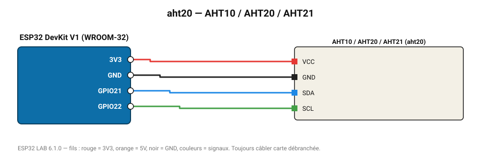

# AHT10 / AHT20 / AHT21

Capteur Aosong économique et précis (±0,3 °C, ±2 % HR), souvent couplé au BMP280.

**Carte :** ESP32 DevKit V1 (WROOM-32) — moniteur série 115200 bauds.

| ESP32 | Composant | Broche | Couleur fil | Remarque |
|---|---|---|---|---|
| 3V3 | AHT10 / AHT20 / AHT21 | VCC | rouge |  |
| GND | AHT10 / AHT20 / AHT21 | GND | noir |  |
| GPIO21 | AHT10 / AHT20 / AHT21 | SDA | bleu |  |
| GPIO22 | AHT10 / AHT20 / AHT21 | SCL | vert |  |

Toujours câbler **carte débranchée**. Masse (GND) commune entre tous les modules.
