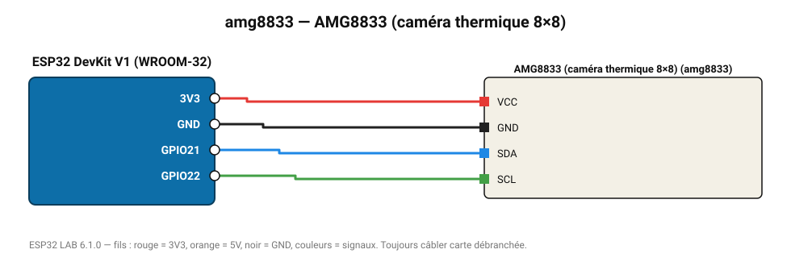

# AMG8833 (caméra thermique 8×8)

Matrice de 64 thermopiles : image thermique 8×8 de 0 à 80 °C jusqu'à 7 m.

**Carte :** ESP32 DevKit V1 (WROOM-32) — moniteur série 115200 bauds.

| ESP32 | Composant | Broche | Couleur fil | Remarque |
|---|---|---|---|---|
| 3V3 | AMG8833 (caméra thermique 8×8) | VCC | rouge |  |
| GND | AMG8833 (caméra thermique 8×8) | GND | noir |  |
| GPIO21 | AMG8833 (caméra thermique 8×8) | SDA | bleu |  |
| GPIO22 | AMG8833 (caméra thermique 8×8) | SCL | vert |  |

Toujours câbler **carte débranchée**. Masse (GND) commune entre tous les modules.
