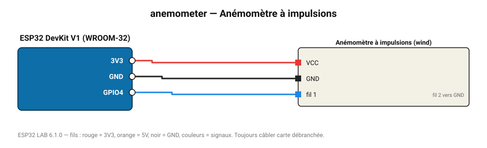

# Anémomètre à impulsions

Anémomètre à contact reed (kit météo SparkFun/Misol) : 1 impulsion/s = 2,4 km/h.

**Carte :** ESP32 DevKit V1 (WROOM-32) — moniteur série 115200 bauds.

| ESP32 | Composant | Broche | Couleur fil | Remarque |
|---|---|---|---|---|
| 3V3 | Anémomètre à impulsions | VCC | rouge |  |
| GND | Anémomètre à impulsions | GND | noir |  |
| GPIO4 | Anémomètre à impulsions | fil 1 | bleu | fil 2 vers GND |

Toujours câbler **carte débranchée**. Masse (GND) commune entre tous les modules.
