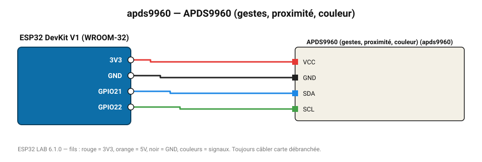

# APDS9960 (gestes, proximité, couleur)

Détecte les gestes haut/bas/gauche/droite, la proximité et la couleur ambiante.

**Carte :** ESP32 DevKit V1 (WROOM-32) — moniteur série 115200 bauds.

| ESP32 | Composant | Broche | Couleur fil | Remarque |
|---|---|---|---|---|
| 3V3 | APDS9960 (gestes, proximité, couleur) | VCC | rouge |  |
| GND | APDS9960 (gestes, proximité, couleur) | GND | noir |  |
| GPIO21 | APDS9960 (gestes, proximité, couleur) | SDA | bleu |  |
| GPIO22 | APDS9960 (gestes, proximité, couleur) | SCL | vert |  |

Toujours câbler **carte débranchée**. Masse (GND) commune entre tous les modules.
