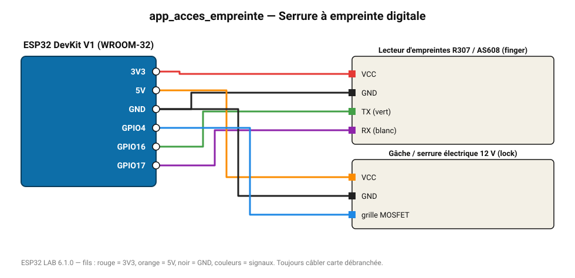

# Serrure à empreinte digitale

Une empreinte reconnue (ID ≥ 1) déverrouille la gâche 3 s.

**Carte :** ESP32 DevKit V1 (WROOM-32) — moniteur série 115200 bauds.

| ESP32 | Composant | Broche | Couleur fil | Remarque |
|---|---|---|---|---|
| 3V3 | Lecteur d'empreintes R307 / AS608 | VCC | rouge |  |
| GND | Lecteur d'empreintes R307 / AS608 | GND | noir |  |
| GPIO16 | Lecteur d'empreintes R307 / AS608 | TX (vert) | vert |  |
| GPIO17 | Lecteur d'empreintes R307 / AS608 | RX (blanc) | violet |  |
| 5V (VIN) | Gâche / serrure électrique 12 V | VCC | orange |  |
| GND | Gâche / serrure électrique 12 V | GND | noir |  |
| GPIO4 | Gâche / serrure électrique 12 V | grille MOSFET | bleu |  |

> ⚠ Consommation de pointe estimée 740 mA : prévoyez une alimentation externe 5 V (le port USB d'un PC fournit ~500 mA).
> ⚠ Alimentez Gâche / serrure électrique 12 V directement en 5 V externe et reliez les masses (GND commun).

Toujours câbler **carte débranchée**. Masse (GND) commune entre tous les modules.
