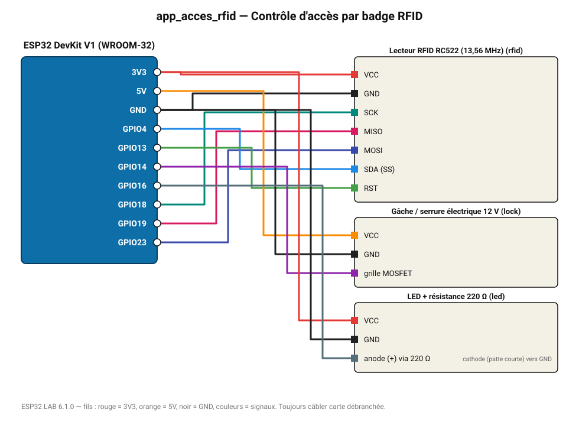

# Contrôle d'accès par badge RFID

Le badge autorisé ouvre la gâche électrique pendant 3 s ; une LED signale l'accès.

**Carte :** ESP32 DevKit V1 (WROOM-32) — moniteur série 115200 bauds.

| ESP32 | Composant | Broche | Couleur fil | Remarque |
|---|---|---|---|---|
| 3V3 | Lecteur RFID RC522 (13,56 MHz) | VCC | rouge |  |
| GND | Lecteur RFID RC522 (13,56 MHz) | GND | noir |  |
| GPIO18 | Lecteur RFID RC522 (13,56 MHz) | SCK | turquoise |  |
| GPIO19 | Lecteur RFID RC522 (13,56 MHz) | MISO | rose |  |
| GPIO23 | Lecteur RFID RC522 (13,56 MHz) | MOSI | indigo |  |
| GPIO4 | Lecteur RFID RC522 (13,56 MHz) | SDA (SS) | bleu |  |
| GPIO13 | Lecteur RFID RC522 (13,56 MHz) | RST | vert |  |
| 5V (VIN) | Gâche / serrure électrique 12 V | VCC | orange |  |
| GND | Gâche / serrure électrique 12 V | GND | noir |  |
| GPIO14 | Gâche / serrure électrique 12 V | grille MOSFET | violet |  |
| 3V3 | LED + résistance 220 Ω | VCC | rouge |  |
| GND | LED + résistance 220 Ω | GND | noir |  |
| GPIO16 | LED + résistance 220 Ω | anode (+) via 220 Ω | gris-bleu | cathode (patte courte) vers GND |

> ⚠ Consommation de pointe estimée 716 mA : prévoyez une alimentation externe 5 V (le port USB d'un PC fournit ~500 mA).
> ⚠ Alimentez Gâche / serrure électrique 12 V directement en 5 V externe et reliez les masses (GND commun).

Toujours câbler **carte débranchée**. Masse (GND) commune entre tous les modules.
