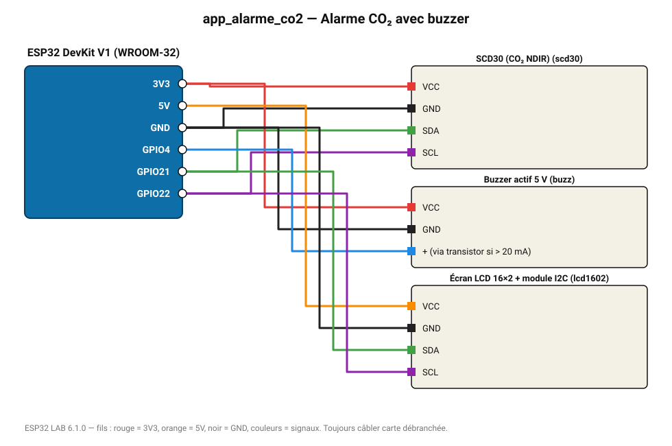

# Alarme CO₂ avec buzzer

Buzzer au-delà de 1500 ppm, affichage LCD du CO₂, de la température et de l'humidité.

**Carte :** ESP32 DevKit V1 (WROOM-32) — moniteur série 115200 bauds.

| ESP32 | Composant | Broche | Couleur fil | Remarque |
|---|---|---|---|---|
| 3V3 | SCD30 (CO₂ NDIR) | VCC | rouge |  |
| GND | SCD30 (CO₂ NDIR) | GND | noir |  |
| GPIO21 | SCD30 (CO₂ NDIR) | SDA | vert |  |
| GPIO22 | SCD30 (CO₂ NDIR) | SCL | violet |  |
| 3V3 | Buzzer actif 5 V | VCC | rouge |  |
| GND | Buzzer actif 5 V | GND | noir |  |
| GPIO4 | Buzzer actif 5 V | + (via transistor si > 20 mA) | bleu |  |
| 5V (VIN) | Écran LCD 16×2 + module I2C | VCC | orange |  |
| GND | Écran LCD 16×2 + module I2C | GND | noir |  |
| GPIO21 | Écran LCD 16×2 + module I2C | SDA | vert |  |
| GPIO22 | Écran LCD 16×2 + module I2C | SCL | violet |  |

Toujours câbler **carte débranchée**. Masse (GND) commune entre tous les modules.
