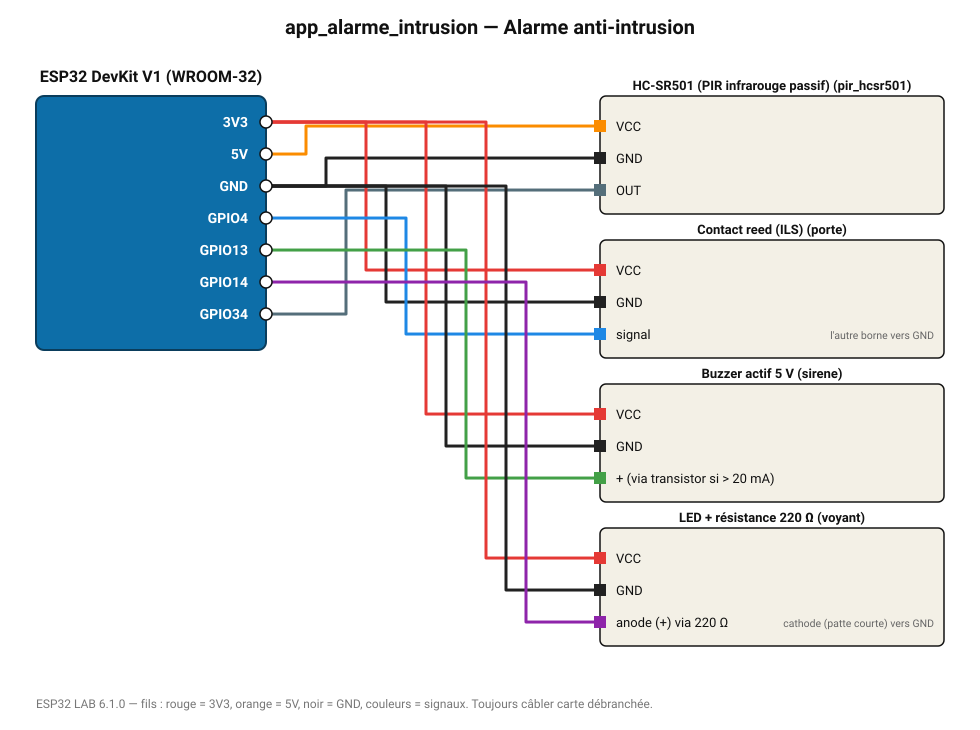

# Alarme anti-intrusion

Détecteur de mouvement PIR + contact de porte : sirène et voyant.

**Carte :** ESP32 DevKit V1 (WROOM-32) — moniteur série 115200 bauds.

| ESP32 | Composant | Broche | Couleur fil | Remarque |
|---|---|---|---|---|
| 5V (VIN) | HC-SR501 (PIR infrarouge passif) | VCC | orange |  |
| GND | HC-SR501 (PIR infrarouge passif) | GND | noir |  |
| GPIO34 | HC-SR501 (PIR infrarouge passif) | OUT | gris-bleu |  |
| 3V3 | Contact reed (ILS) | VCC | rouge |  |
| GND | Contact reed (ILS) | GND | noir |  |
| GPIO4 | Contact reed (ILS) | signal | bleu | l'autre borne vers GND |
| 3V3 | Buzzer actif 5 V | VCC | rouge |  |
| GND | Buzzer actif 5 V | GND | noir |  |
| GPIO13 | Buzzer actif 5 V | + (via transistor si > 20 mA) | vert |  |
| 3V3 | LED + résistance 220 Ω | VCC | rouge |  |
| GND | LED + résistance 220 Ω | GND | noir |  |
| GPIO14 | LED + résistance 220 Ω | anode (+) via 220 Ω | violet | cathode (patte courte) vers GND |

Toujours câbler **carte débranchée**. Masse (GND) commune entre tous les modules.
