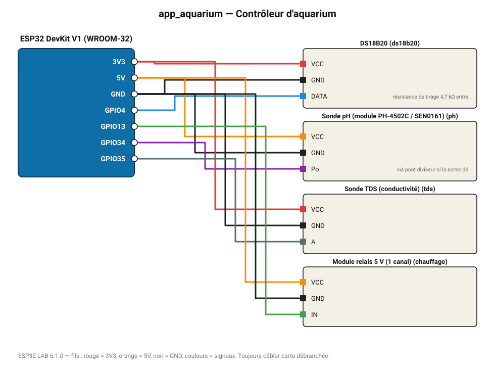

# Contrôleur d'aquarium

Température (chauffage sous 24,5 °C), pH et TDS de l'eau, page web de suivi.

**Carte :** ESP32 DevKit V1 (WROOM-32) — moniteur série 115200 bauds.

| ESP32 | Composant | Broche | Couleur fil | Remarque |
|---|---|---|---|---|
| 3V3 | DS18B20 | VCC | rouge |  |
| GND | DS18B20 | GND | noir |  |
| GPIO4 | DS18B20 | DATA | bleu | résistance de tirage 4,7 kΩ entre DATA et 3V3 obligatoire |
| 5V (VIN) | Sonde pH (module PH-4502C / SEN0161) | VCC | orange |  |
| GND | Sonde pH (module PH-4502C / SEN0161) | GND | noir |  |
| GPIO34 | Sonde pH (module PH-4502C / SEN0161) | Po | violet | via pont diviseur si la sortie dépasse 3,3 V |
| 3V3 | Sonde TDS (conductivité) | VCC | rouge |  |
| GND | Sonde TDS (conductivité) | GND | noir |  |
| GPIO35 | Sonde TDS (conductivité) | A | gris-bleu |  |
| 5V (VIN) | Module relais 5 V (1 canal) | VCC | orange |  |
| GND | Module relais 5 V (1 canal) | GND | noir |  |
| GPIO13 | Module relais 5 V (1 canal) | IN | vert |  |

Toujours câbler **carte débranchée**. Masse (GND) commune entre tous les modules.
