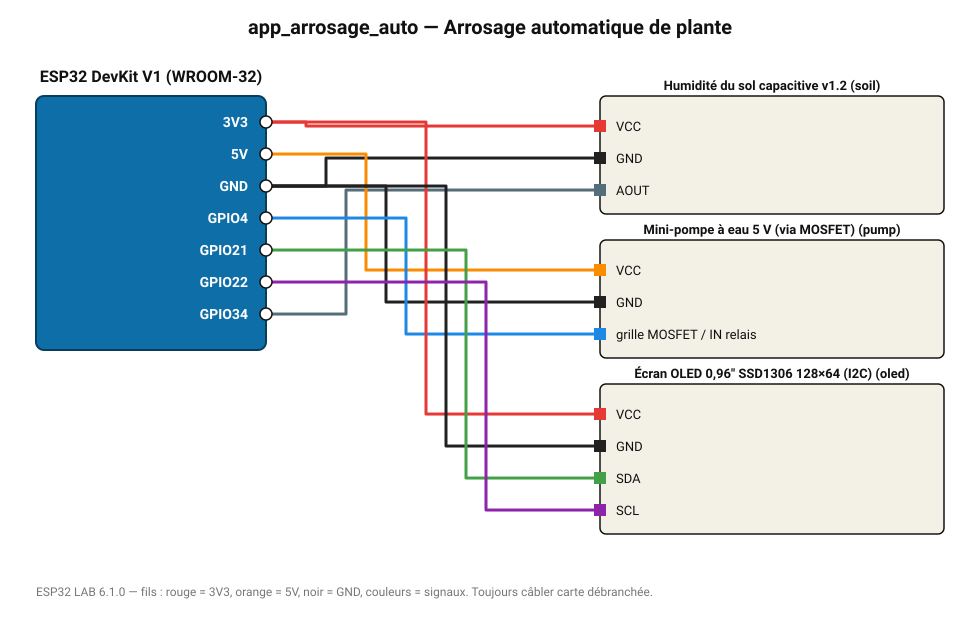

# Arrosage automatique de plante

La pompe démarre sous 30 % d'humidité du sol et s'arrête à 40 % (sécurité 20 s max).

**Carte :** ESP32 DevKit V1 (WROOM-32) — moniteur série 115200 bauds.

| ESP32 | Composant | Broche | Couleur fil | Remarque |
|---|---|---|---|---|
| 3V3 | Humidité du sol capacitive v1.2 | VCC | rouge |  |
| GND | Humidité du sol capacitive v1.2 | GND | noir |  |
| GPIO34 | Humidité du sol capacitive v1.2 | AOUT | gris-bleu |  |
| 5V (VIN) | Mini-pompe à eau 5 V (via MOSFET) | VCC | orange |  |
| GND | Mini-pompe à eau 5 V (via MOSFET) | GND | noir |  |
| GPIO4 | Mini-pompe à eau 5 V (via MOSFET) | grille MOSFET / IN relais | bleu |  |
| 3V3 | Écran OLED 0,96" SSD1306 128×64 (I2C) | VCC | rouge |  |
| GND | Écran OLED 0,96" SSD1306 128×64 (I2C) | GND | noir |  |
| GPIO21 | Écran OLED 0,96" SSD1306 128×64 (I2C) | SDA | vert |  |
| GPIO22 | Écran OLED 0,96" SSD1306 128×64 (I2C) | SCL | violet |  |

> ⚠ Consommation de pointe estimée 681 mA : prévoyez une alimentation externe 5 V (le port USB d'un PC fournit ~500 mA).
> ⚠ Alimentez Mini-pompe à eau 5 V (via MOSFET) directement en 5 V externe et reliez les masses (GND commun).

Toujours câbler **carte débranchée**. Masse (GND) commune entre tous les modules.
