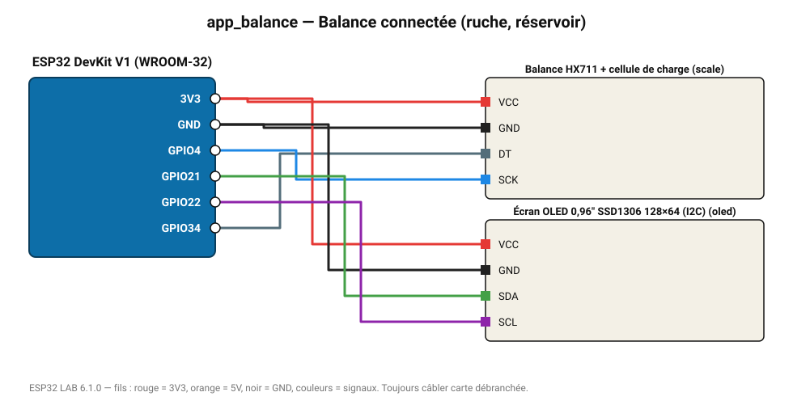

# Balance connectée (ruche, réservoir)

Pesée par cellule de charge, affichage OLED et envoi au MASTER.

**Carte :** ESP32 DevKit V1 (WROOM-32) — moniteur série 115200 bauds.

| ESP32 | Composant | Broche | Couleur fil | Remarque |
|---|---|---|---|---|
| 3V3 | Balance HX711 + cellule de charge | VCC | rouge |  |
| GND | Balance HX711 + cellule de charge | GND | noir |  |
| GPIO34 | Balance HX711 + cellule de charge | DT | gris-bleu |  |
| GPIO4 | Balance HX711 + cellule de charge | SCK | bleu |  |
| 3V3 | Écran OLED 0,96" SSD1306 128×64 (I2C) | VCC | rouge |  |
| GND | Écran OLED 0,96" SSD1306 128×64 (I2C) | GND | noir |  |
| GPIO21 | Écran OLED 0,96" SSD1306 128×64 (I2C) | SDA | vert |  |
| GPIO22 | Écran OLED 0,96" SSD1306 128×64 (I2C) | SCL | violet |  |

Toujours câbler **carte débranchée**. Masse (GND) commune entre tous les modules.
