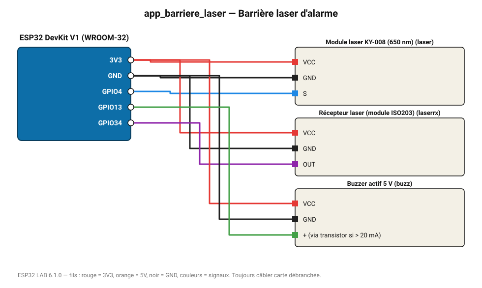

# Barrière laser d'alarme

Un faisceau laser traverse la pièce ; s'il est coupé, la sirène retentit.

**Carte :** ESP32 DevKit V1 (WROOM-32) — moniteur série 115200 bauds.

| ESP32 | Composant | Broche | Couleur fil | Remarque |
|---|---|---|---|---|
| 3V3 | Module laser KY-008 (650 nm) | VCC | rouge |  |
| GND | Module laser KY-008 (650 nm) | GND | noir |  |
| GPIO4 | Module laser KY-008 (650 nm) | S | bleu |  |
| 3V3 | Récepteur laser (module ISO203) | VCC | rouge |  |
| GND | Récepteur laser (module ISO203) | GND | noir |  |
| GPIO34 | Récepteur laser (module ISO203) | OUT | violet |  |
| 3V3 | Buzzer actif 5 V | VCC | rouge |  |
| GND | Buzzer actif 5 V | GND | noir |  |
| GPIO13 | Buzzer actif 5 V | + (via transistor si > 20 mA) | vert |  |

Toujours câbler **carte débranchée**. Masse (GND) commune entre tous les modules.
