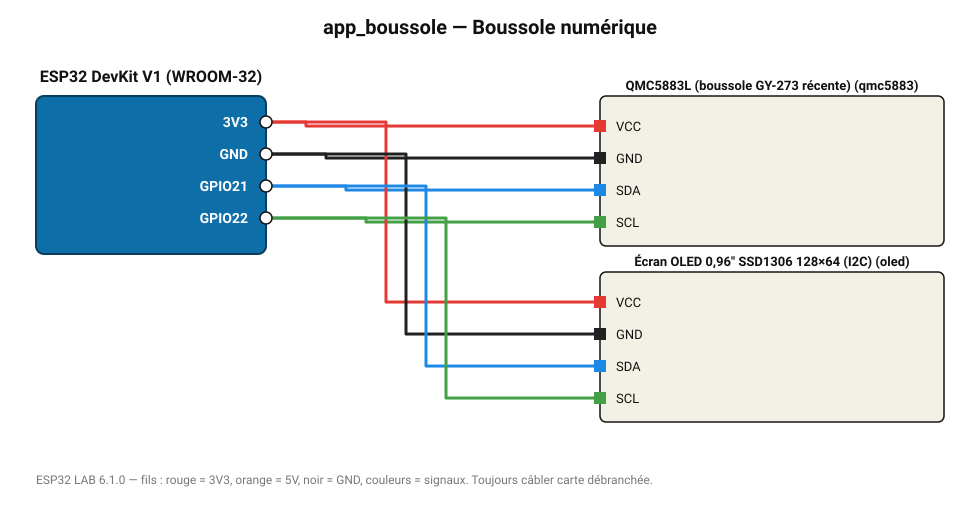

# Boussole numérique

Cap magnétique en degrés sur OLED (QMC5883L).

**Carte :** ESP32 DevKit V1 (WROOM-32) — moniteur série 115200 bauds.

| ESP32 | Composant | Broche | Couleur fil | Remarque |
|---|---|---|---|---|
| 3V3 | QMC5883L (boussole GY-273 récente) | VCC | rouge |  |
| GND | QMC5883L (boussole GY-273 récente) | GND | noir |  |
| GPIO21 | QMC5883L (boussole GY-273 récente) | SDA | bleu |  |
| GPIO22 | QMC5883L (boussole GY-273 récente) | SCL | vert |  |
| 3V3 | Écran OLED 0,96" SSD1306 128×64 (I2C) | VCC | rouge |  |
| GND | Écran OLED 0,96" SSD1306 128×64 (I2C) | GND | noir |  |
| GPIO21 | Écran OLED 0,96" SSD1306 128×64 (I2C) | SDA | bleu |  |
| GPIO22 | Écran OLED 0,96" SSD1306 128×64 (I2C) | SCL | vert |  |

Toujours câbler **carte débranchée**. Masse (GND) commune entre tous les modules.
