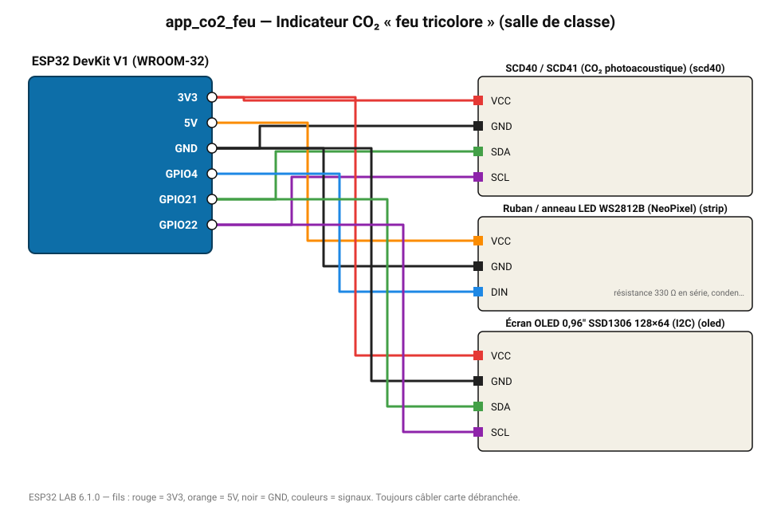

# Indicateur CO₂ « feu tricolore » (salle de classe)

Un anneau LED passe du vert (400 ppm) au rouge (1500 ppm) : signal clair pour aérer.

**Carte :** ESP32 DevKit V1 (WROOM-32) — moniteur série 115200 bauds.

| ESP32 | Composant | Broche | Couleur fil | Remarque |
|---|---|---|---|---|
| 3V3 | SCD40 / SCD41 (CO₂ photoacoustique) | VCC | rouge |  |
| GND | SCD40 / SCD41 (CO₂ photoacoustique) | GND | noir |  |
| GPIO21 | SCD40 / SCD41 (CO₂ photoacoustique) | SDA | vert |  |
| GPIO22 | SCD40 / SCD41 (CO₂ photoacoustique) | SCL | violet |  |
| 5V (VIN) | Ruban / anneau LED WS2812B (NeoPixel) | VCC | orange |  |
| GND | Ruban / anneau LED WS2812B (NeoPixel) | GND | noir |  |
| GPIO4 | Ruban / anneau LED WS2812B (NeoPixel) | DIN | bleu | résistance 330 Ω en série, condensateur 1000 µF sur l'alimentation |
| 3V3 | Écran OLED 0,96" SSD1306 128×64 (I2C) | VCC | rouge |  |
| GND | Écran OLED 0,96" SSD1306 128×64 (I2C) | GND | noir |  |
| GPIO21 | Écran OLED 0,96" SSD1306 128×64 (I2C) | SDA | vert |  |
| GPIO22 | Écran OLED 0,96" SSD1306 128×64 (I2C) | SCL | violet |  |

> ⚠ Consommation de pointe estimée 965 mA : prévoyez une alimentation externe 5 V (le port USB d'un PC fournit ~500 mA).
> ⚠ Alimentez Ruban / anneau LED WS2812B (NeoPixel) directement en 5 V externe et reliez les masses (GND commun).
> ⚠ Ruban / anneau LED WS2812B (NeoPixel) : la donnée 3,3 V fonctionne en général ; pour les longs rubans, un 74AHCT125 améliore la fiabilité.

Toujours câbler **carte débranchée**. Masse (GND) commune entre tous les modules.
