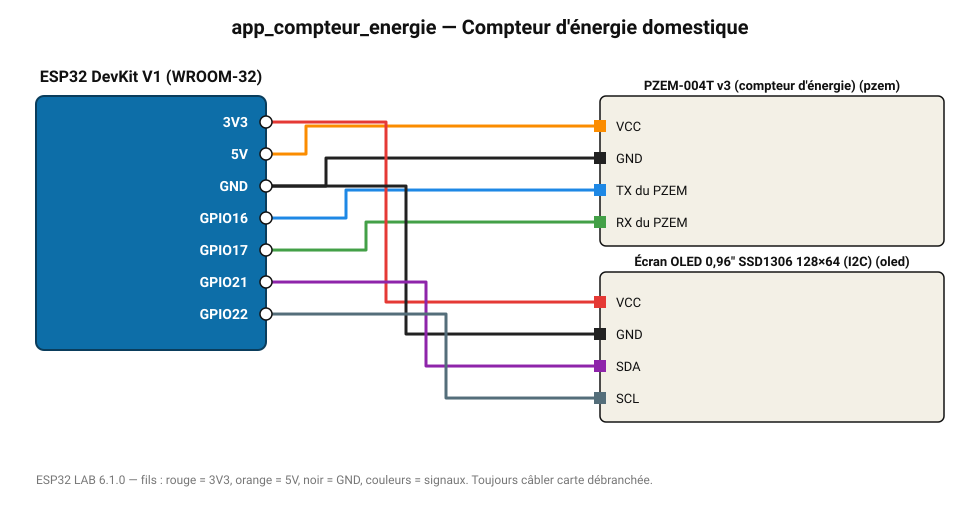

# Compteur d'énergie domestique

Tension, courant, puissance, kWh et facteur de puissance, publiés en web, MQTT et vers le MASTER.

**Carte :** ESP32 DevKit V1 (WROOM-32) — moniteur série 115200 bauds.

| ESP32 | Composant | Broche | Couleur fil | Remarque |
|---|---|---|---|---|
| 5V (VIN) | PZEM-004T v3 (compteur d'énergie) | VCC | orange |  |
| GND | PZEM-004T v3 (compteur d'énergie) | GND | noir |  |
| GPIO16 | PZEM-004T v3 (compteur d'énergie) | TX du PZEM | bleu |  |
| GPIO17 | PZEM-004T v3 (compteur d'énergie) | RX du PZEM | vert |  |
| 3V3 | Écran OLED 0,96" SSD1306 128×64 (I2C) | VCC | rouge |  |
| GND | Écran OLED 0,96" SSD1306 128×64 (I2C) | GND | noir |  |
| GPIO21 | Écran OLED 0,96" SSD1306 128×64 (I2C) | SDA | violet |  |
| GPIO22 | Écran OLED 0,96" SSD1306 128×64 (I2C) | SCL | gris-bleu |  |

Toujours câbler **carte débranchée**. Masse (GND) commune entre tous les modules.
