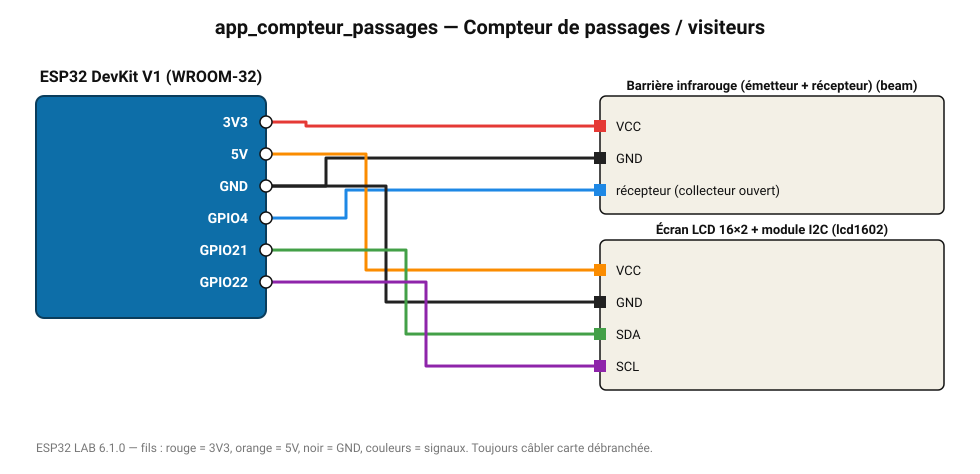

# Compteur de passages / visiteurs

Chaque coupure de la barrière IR incrémente le compteur affiché sur LCD et sur le web.

**Carte :** ESP32 DevKit V1 (WROOM-32) — moniteur série 115200 bauds.

| ESP32 | Composant | Broche | Couleur fil | Remarque |
|---|---|---|---|---|
| 3V3 | Barrière infrarouge (émetteur + récepteur) | VCC | rouge |  |
| GND | Barrière infrarouge (émetteur + récepteur) | GND | noir |  |
| GPIO4 | Barrière infrarouge (émetteur + récepteur) | récepteur (collecteur ouvert) | bleu |  |
| 5V (VIN) | Écran LCD 16×2 + module I2C | VCC | orange |  |
| GND | Écran LCD 16×2 + module I2C | GND | noir |  |
| GPIO21 | Écran LCD 16×2 + module I2C | SDA | vert |  |
| GPIO22 | Écran LCD 16×2 + module I2C | SCL | violet |  |

Toujours câbler **carte débranchée**. Masse (GND) commune entre tous les modules.
