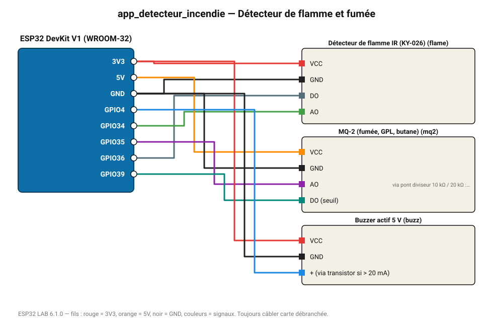

# Détecteur de flamme et fumée

Alarme dès qu'une flamme est vue par le capteur IR ; niveau de fumée MQ-2 surveillé.

**Carte :** ESP32 DevKit V1 (WROOM-32) — moniteur série 115200 bauds.

| ESP32 | Composant | Broche | Couleur fil | Remarque |
|---|---|---|---|---|
| 3V3 | Détecteur de flamme IR (KY-026) | VCC | rouge |  |
| GND | Détecteur de flamme IR (KY-026) | GND | noir |  |
| GPIO36 | Détecteur de flamme IR (KY-026) | DO | gris-bleu |  |
| GPIO34 | Détecteur de flamme IR (KY-026) | AO | vert |  |
| 5V (VIN) | MQ-2 (fumée, GPL, butane) | VCC | orange |  |
| GND | MQ-2 (fumée, GPL, butane) | GND | noir |  |
| GPIO35 | MQ-2 (fumée, GPL, butane) | AO | violet | via pont diviseur 10 kΩ / 20 kΩ : la sortie monte à 5 V |
| GPIO39 | MQ-2 (fumée, GPL, butane) | DO (seuil) | turquoise |  |
| 3V3 | Buzzer actif 5 V | VCC | rouge |  |
| GND | Buzzer actif 5 V | GND | noir |  |
| GPIO4 | Buzzer actif 5 V | + (via transistor si > 20 mA) | bleu |  |

Toujours câbler **carte débranchée**. Masse (GND) commune entre tous les modules.
