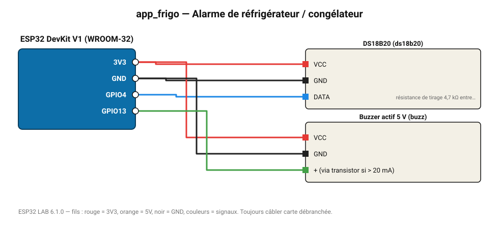

# Alarme de réfrigérateur / congélateur

Bip si la température dépasse 8 °C (porte mal fermée, panne) ; valeur envoyée au MASTER.

**Carte :** ESP32 DevKit V1 (WROOM-32) — moniteur série 115200 bauds.

| ESP32 | Composant | Broche | Couleur fil | Remarque |
|---|---|---|---|---|
| 3V3 | DS18B20 | VCC | rouge |  |
| GND | DS18B20 | GND | noir |  |
| GPIO4 | DS18B20 | DATA | bleu | résistance de tirage 4,7 kΩ entre DATA et 3V3 obligatoire |
| 3V3 | Buzzer actif 5 V | VCC | rouge |  |
| GND | Buzzer actif 5 V | GND | noir |  |
| GPIO13 | Buzzer actif 5 V | + (via transistor si > 20 mA) | vert |  |

Toujours câbler **carte débranchée**. Masse (GND) commune entre tous les modules.
