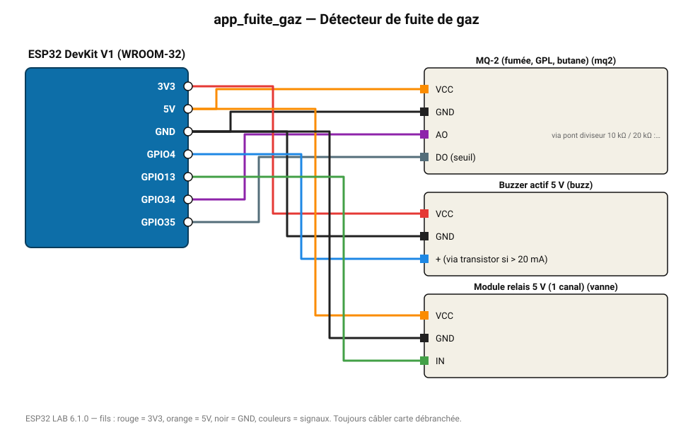

# Détecteur de fuite de gaz

Alarme sonore et coupure d'une électrovanne (relais) au-delà d'un seuil de gaz (démonstration pédagogique).

**Carte :** ESP32 DevKit V1 (WROOM-32) — moniteur série 115200 bauds.

| ESP32 | Composant | Broche | Couleur fil | Remarque |
|---|---|---|---|---|
| 5V (VIN) | MQ-2 (fumée, GPL, butane) | VCC | orange |  |
| GND | MQ-2 (fumée, GPL, butane) | GND | noir |  |
| GPIO34 | MQ-2 (fumée, GPL, butane) | AO | violet | via pont diviseur 10 kΩ / 20 kΩ : la sortie monte à 5 V |
| GPIO35 | MQ-2 (fumée, GPL, butane) | DO (seuil) | gris-bleu |  |
| 3V3 | Buzzer actif 5 V | VCC | rouge |  |
| GND | Buzzer actif 5 V | GND | noir |  |
| GPIO4 | Buzzer actif 5 V | + (via transistor si > 20 mA) | bleu |  |
| 5V (VIN) | Module relais 5 V (1 canal) | VCC | orange |  |
| GND | Module relais 5 V (1 canal) | GND | noir |  |
| GPIO13 | Module relais 5 V (1 canal) | IN | vert |  |

Toujours câbler **carte débranchée**. Masse (GND) commune entre tous les modules.
