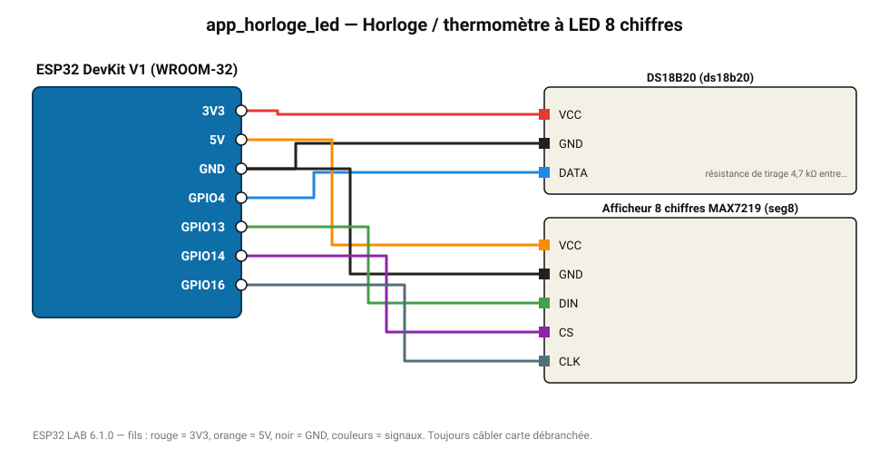

# Horloge / thermomètre à LED 8 chiffres

Grands chiffres lumineux : température d'une sonde DS18B20 sur afficheur MAX7219.

**Carte :** ESP32 DevKit V1 (WROOM-32) — moniteur série 115200 bauds.

| ESP32 | Composant | Broche | Couleur fil | Remarque |
|---|---|---|---|---|
| 3V3 | DS18B20 | VCC | rouge |  |
| GND | DS18B20 | GND | noir |  |
| GPIO4 | DS18B20 | DATA | bleu | résistance de tirage 4,7 kΩ entre DATA et 3V3 obligatoire |
| 5V (VIN) | Afficheur 8 chiffres MAX7219 | VCC | orange |  |
| GND | Afficheur 8 chiffres MAX7219 | GND | noir |  |
| GPIO13 | Afficheur 8 chiffres MAX7219 | DIN | vert |  |
| GPIO14 | Afficheur 8 chiffres MAX7219 | CS | violet |  |
| GPIO16 | Afficheur 8 chiffres MAX7219 | CLK | gris-bleu |  |

Toujours câbler **carte débranchée**. Masse (GND) commune entre tous les modules.
