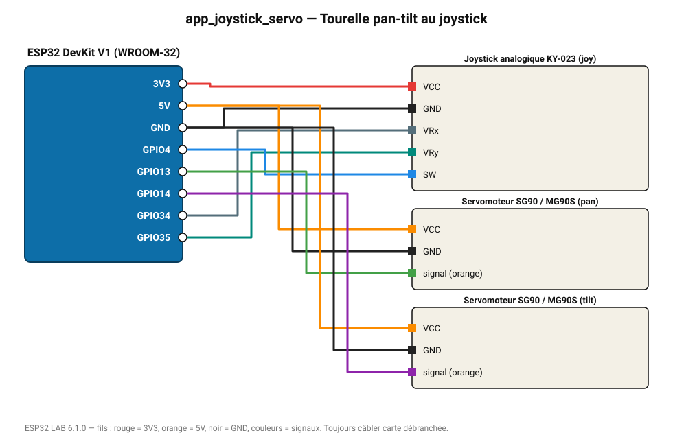

# Tourelle pan-tilt au joystick

Deux servos (panoramique et inclinaison) suivent les axes d'un joystick.

**Carte :** ESP32 DevKit V1 (WROOM-32) — moniteur série 115200 bauds.

| ESP32 | Composant | Broche | Couleur fil | Remarque |
|---|---|---|---|---|
| 3V3 | Joystick analogique KY-023 | VCC | rouge |  |
| GND | Joystick analogique KY-023 | GND | noir |  |
| GPIO34 | Joystick analogique KY-023 | VRx | gris-bleu |  |
| GPIO35 | Joystick analogique KY-023 | VRy | turquoise |  |
| GPIO4 | Joystick analogique KY-023 | SW | bleu |  |
| 5V (VIN) | Servomoteur SG90 / MG90S | VCC | orange |  |
| GND | Servomoteur SG90 / MG90S | GND | noir |  |
| GPIO13 | Servomoteur SG90 / MG90S | signal (orange) | vert |  |
| 5V (VIN) | Servomoteur SG90 / MG90S | VCC | orange |  |
| GND | Servomoteur SG90 / MG90S | GND | noir |  |
| GPIO14 | Servomoteur SG90 / MG90S | signal (orange) | violet |  |

> ⚠ Consommation de pointe estimée 1381 mA : prévoyez une alimentation externe 5 V (le port USB d'un PC fournit ~500 mA).
> ⚠ Alimentez Servomoteur SG90 / MG90S, Servomoteur SG90 / MG90S directement en 5 V externe et reliez les masses (GND commun).

Toujours câbler **carte débranchée**. Masse (GND) commune entre tous les modules.
