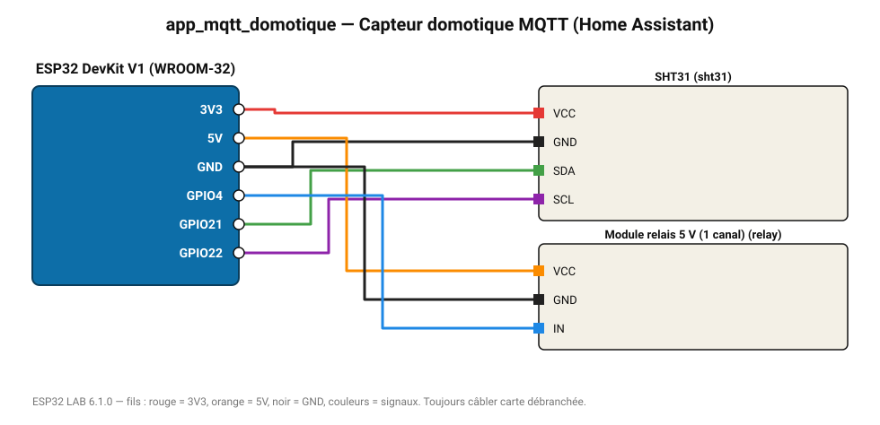

# Capteur domotique MQTT (Home Assistant)

Température/humidité et relais publiés sur un broker MQTT (Mosquitto, Home Assistant).

**Carte :** ESP32 DevKit V1 (WROOM-32) — moniteur série 115200 bauds.

| ESP32 | Composant | Broche | Couleur fil | Remarque |
|---|---|---|---|---|
| 3V3 | SHT31 | VCC | rouge |  |
| GND | SHT31 | GND | noir |  |
| GPIO21 | SHT31 | SDA | vert |  |
| GPIO22 | SHT31 | SCL | violet |  |
| 5V (VIN) | Module relais 5 V (1 canal) | VCC | orange |  |
| GND | Module relais 5 V (1 canal) | GND | noir |  |
| GPIO4 | Module relais 5 V (1 canal) | IN | bleu |  |

Toujours câbler **carte débranchée**. Masse (GND) commune entre tous les modules.
