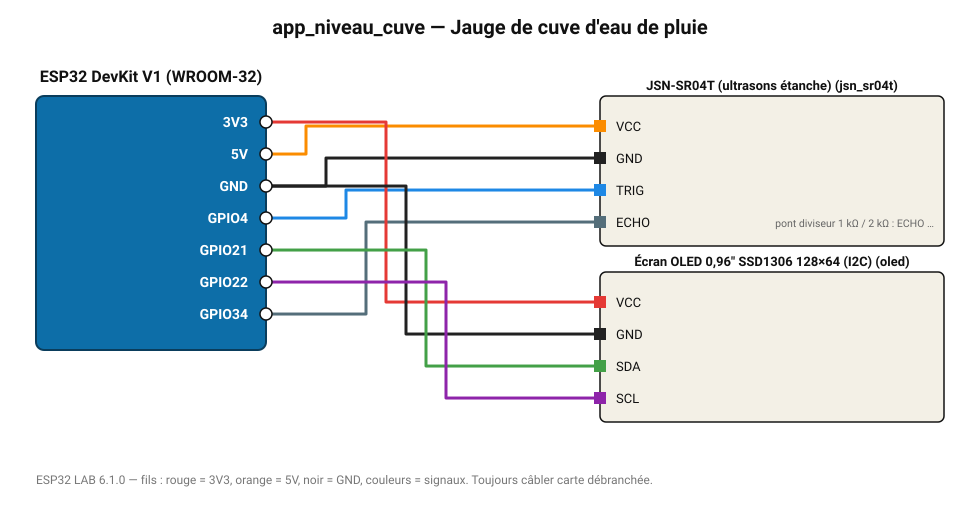

# Jauge de cuve d'eau de pluie

Capteur ultrason étanche au-dessus de l'eau, distance affichée sur OLED et sur le web.

**Carte :** ESP32 DevKit V1 (WROOM-32) — moniteur série 115200 bauds.

| ESP32 | Composant | Broche | Couleur fil | Remarque |
|---|---|---|---|---|
| 5V (VIN) | JSN-SR04T (ultrasons étanche) | VCC | orange |  |
| GND | JSN-SR04T (ultrasons étanche) | GND | noir |  |
| GPIO4 | JSN-SR04T (ultrasons étanche) | TRIG | bleu |  |
| GPIO34 | JSN-SR04T (ultrasons étanche) | ECHO | gris-bleu | pont diviseur 1 kΩ / 2 kΩ : ECHO sort du 5 V |
| 3V3 | Écran OLED 0,96" SSD1306 128×64 (I2C) | VCC | rouge |  |
| GND | Écran OLED 0,96" SSD1306 128×64 (I2C) | GND | noir |  |
| GPIO21 | Écran OLED 0,96" SSD1306 128×64 (I2C) | SDA | vert |  |
| GPIO22 | Écran OLED 0,96" SSD1306 128×64 (I2C) | SCL | violet |  |

> ⚠ JSN-SR04T (ultrasons étanche) : la broche ECHO délivre 5 V : utilisez un pont diviseur (1 kΩ / 2 kΩ) ou un convertisseur de niveau.

Toujours câbler **carte débranchée**. Masse (GND) commune entre tous les modules.
