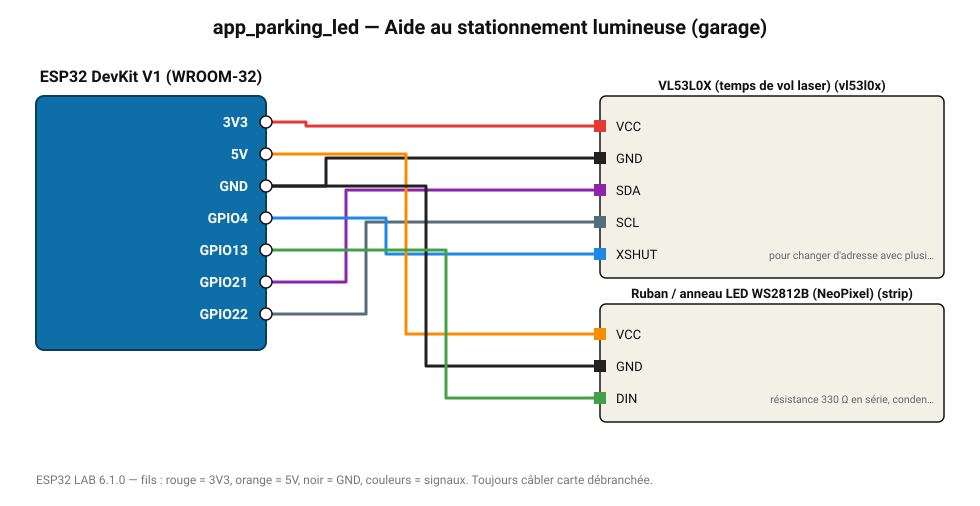

# Aide au stationnement lumineuse (garage)

Capteur laser au fond du garage : l'anneau passe du vert au rouge en approchant du mur.

**Carte :** ESP32 DevKit V1 (WROOM-32) — moniteur série 115200 bauds.

| ESP32 | Composant | Broche | Couleur fil | Remarque |
|---|---|---|---|---|
| 3V3 | VL53L0X (temps de vol laser) | VCC | rouge |  |
| GND | VL53L0X (temps de vol laser) | GND | noir |  |
| GPIO21 | VL53L0X (temps de vol laser) | SDA | violet |  |
| GPIO22 | VL53L0X (temps de vol laser) | SCL | gris-bleu |  |
| GPIO4 | VL53L0X (temps de vol laser) | XSHUT | bleu | pour changer d'adresse avec plusieurs capteurs |
| 5V (VIN) | Ruban / anneau LED WS2812B (NeoPixel) | VCC | orange |  |
| GND | Ruban / anneau LED WS2812B (NeoPixel) | GND | noir |  |
| GPIO13 | Ruban / anneau LED WS2812B (NeoPixel) | DIN | vert | résistance 330 Ω en série, condensateur 1000 µF sur l'alimentation |

> ⚠ Consommation de pointe estimée 579 mA : prévoyez une alimentation externe 5 V (le port USB d'un PC fournit ~500 mA).
> ⚠ Alimentez Ruban / anneau LED WS2812B (NeoPixel) directement en 5 V externe et reliez les masses (GND commun).
> ⚠ Ruban / anneau LED WS2812B (NeoPixel) : la donnée 3,3 V fonctionne en général ; pour les longs rubans, un 74AHCT125 améliore la fiabilité.

Toujours câbler **carte débranchée**. Masse (GND) commune entre tous les modules.
