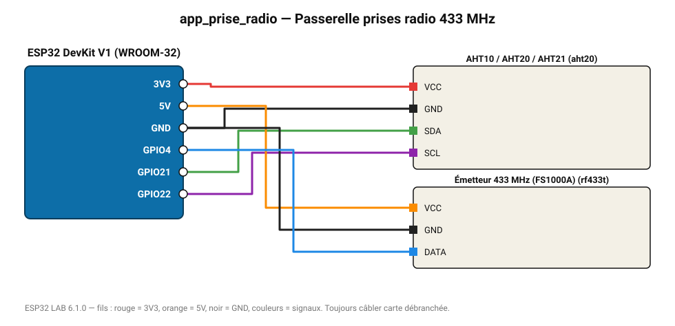

# Passerelle prises radio 433 MHz

Pilote une prise radiocommandée 433 MHz selon la température, et publie les mesures en MQTT.

**Carte :** ESP32 DevKit V1 (WROOM-32) — moniteur série 115200 bauds.

| ESP32 | Composant | Broche | Couleur fil | Remarque |
|---|---|---|---|---|
| 3V3 | AHT10 / AHT20 / AHT21 | VCC | rouge |  |
| GND | AHT10 / AHT20 / AHT21 | GND | noir |  |
| GPIO21 | AHT10 / AHT20 / AHT21 | SDA | vert |  |
| GPIO22 | AHT10 / AHT20 / AHT21 | SCL | violet |  |
| 5V (VIN) | Émetteur 433 MHz (FS1000A) | VCC | orange |  |
| GND | Émetteur 433 MHz (FS1000A) | GND | noir |  |
| GPIO4 | Émetteur 433 MHz (FS1000A) | DATA | bleu |  |

Toujours câbler **carte débranchée**. Masse (GND) commune entre tous les modules.
