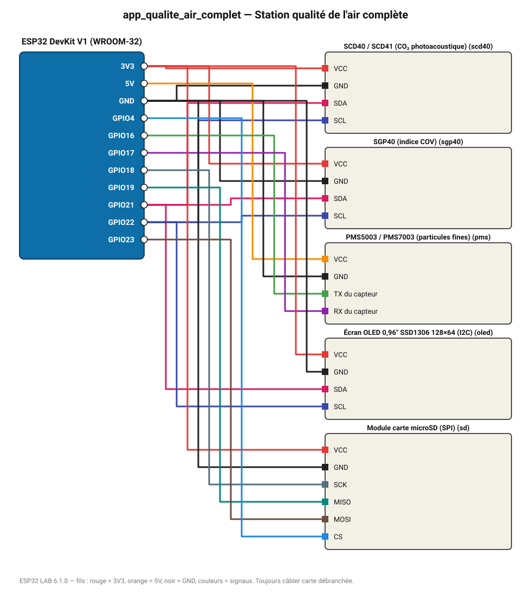

# Station qualité de l'air complète

CO₂, COV, particules, température et humidité, enregistrés sur microSD et affichés sur OLED.

**Carte :** ESP32 DevKit V1 (WROOM-32) — moniteur série 115200 bauds.

| ESP32 | Composant | Broche | Couleur fil | Remarque |
|---|---|---|---|---|
| 3V3 | SCD40 / SCD41 (CO₂ photoacoustique) | VCC | rouge |  |
| GND | SCD40 / SCD41 (CO₂ photoacoustique) | GND | noir |  |
| GPIO21 | SCD40 / SCD41 (CO₂ photoacoustique) | SDA | rose |  |
| GPIO22 | SCD40 / SCD41 (CO₂ photoacoustique) | SCL | indigo |  |
| 3V3 | SGP40 (indice COV) | VCC | rouge |  |
| GND | SGP40 (indice COV) | GND | noir |  |
| GPIO21 | SGP40 (indice COV) | SDA | rose |  |
| GPIO22 | SGP40 (indice COV) | SCL | indigo |  |
| 5V (VIN) | PMS5003 / PMS7003 (particules fines) | VCC | orange |  |
| GND | PMS5003 / PMS7003 (particules fines) | GND | noir |  |
| GPIO16 | PMS5003 / PMS7003 (particules fines) | TX du capteur | vert |  |
| GPIO17 | PMS5003 / PMS7003 (particules fines) | RX du capteur | violet |  |
| 3V3 | Écran OLED 0,96" SSD1306 128×64 (I2C) | VCC | rouge |  |
| GND | Écran OLED 0,96" SSD1306 128×64 (I2C) | GND | noir |  |
| GPIO21 | Écran OLED 0,96" SSD1306 128×64 (I2C) | SDA | rose |  |
| GPIO22 | Écran OLED 0,96" SSD1306 128×64 (I2C) | SCL | indigo |  |
| 3V3 | Module carte microSD (SPI) | VCC | rouge |  |
| GND | Module carte microSD (SPI) | GND | noir |  |
| GPIO18 | Module carte microSD (SPI) | SCK | gris-bleu |  |
| GPIO19 | Module carte microSD (SPI) | MISO | turquoise |  |
| GPIO23 | Module carte microSD (SPI) | MOSI | marron |  |
| GPIO4 | Module carte microSD (SPI) | CS | bleu |  |

> ⚠ Consommation de pointe estimée 688 mA : prévoyez une alimentation externe 5 V (le port USB d'un PC fournit ~500 mA).

Toujours câbler **carte débranchée**. Masse (GND) commune entre tous les modules.
