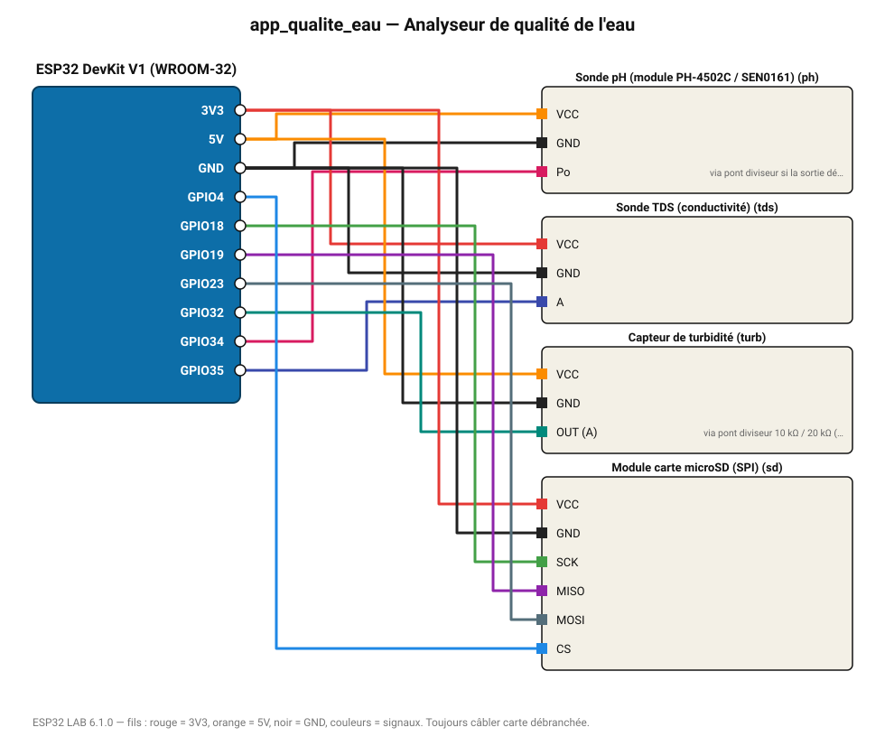

# Analyseur de qualité de l'eau

pH, solides dissous et turbidité mesurés ensemble, journalisés sur microSD.

**Carte :** ESP32 DevKit V1 (WROOM-32) — moniteur série 115200 bauds.

| ESP32 | Composant | Broche | Couleur fil | Remarque |
|---|---|---|---|---|
| 5V (VIN) | Sonde pH (module PH-4502C / SEN0161) | VCC | orange |  |
| GND | Sonde pH (module PH-4502C / SEN0161) | GND | noir |  |
| GPIO34 | Sonde pH (module PH-4502C / SEN0161) | Po | rose | via pont diviseur si la sortie dépasse 3,3 V |
| 3V3 | Sonde TDS (conductivité) | VCC | rouge |  |
| GND | Sonde TDS (conductivité) | GND | noir |  |
| GPIO35 | Sonde TDS (conductivité) | A | indigo |  |
| 5V (VIN) | Capteur de turbidité | VCC | orange |  |
| GND | Capteur de turbidité | GND | noir |  |
| GPIO32 | Capteur de turbidité | OUT (A) | turquoise | via pont diviseur 10 kΩ / 20 kΩ (sortie 0-4,5 V) |
| 3V3 | Module carte microSD (SPI) | VCC | rouge |  |
| GND | Module carte microSD (SPI) | GND | noir |  |
| GPIO18 | Module carte microSD (SPI) | SCK | vert |  |
| GPIO19 | Module carte microSD (SPI) | MISO | violet |  |
| GPIO23 | Module carte microSD (SPI) | MOSI | gris-bleu |  |
| GPIO4 | Module carte microSD (SPI) | CS | bleu |  |

Toujours câbler **carte débranchée**. Masse (GND) commune entre tous les modules.
