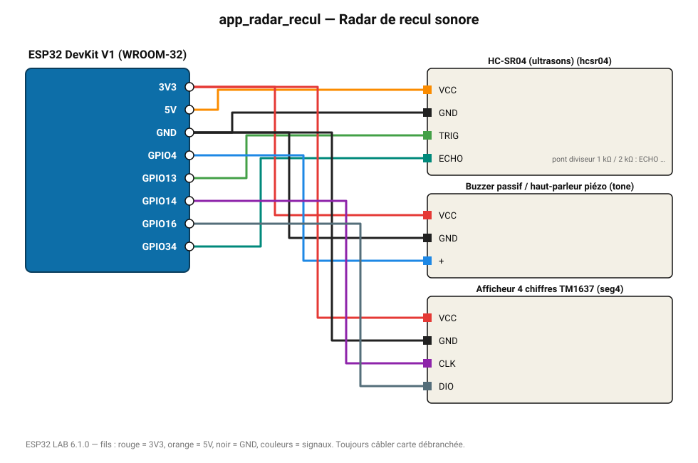

# Radar de recul sonore

Plus l'obstacle est proche, plus le bip est aigu ; distance sur afficheur 4 chiffres.

**Carte :** ESP32 DevKit V1 (WROOM-32) — moniteur série 115200 bauds.

| ESP32 | Composant | Broche | Couleur fil | Remarque |
|---|---|---|---|---|
| 5V (VIN) | HC-SR04 (ultrasons) | VCC | orange |  |
| GND | HC-SR04 (ultrasons) | GND | noir |  |
| GPIO13 | HC-SR04 (ultrasons) | TRIG | vert |  |
| GPIO34 | HC-SR04 (ultrasons) | ECHO | turquoise | pont diviseur 1 kΩ / 2 kΩ : ECHO sort du 5 V |
| 3V3 | Buzzer passif / haut-parleur piézo | VCC | rouge |  |
| GND | Buzzer passif / haut-parleur piézo | GND | noir |  |
| GPIO4 | Buzzer passif / haut-parleur piézo | + | bleu |  |
| 3V3 | Afficheur 4 chiffres TM1637 | VCC | rouge |  |
| GND | Afficheur 4 chiffres TM1637 | GND | noir |  |
| GPIO14 | Afficheur 4 chiffres TM1637 | CLK | violet |  |
| GPIO16 | Afficheur 4 chiffres TM1637 | DIO | gris-bleu |  |

> ⚠ HC-SR04 (ultrasons) : la broche ECHO délivre 5 V : utilisez un pont diviseur (1 kΩ / 2 kΩ) ou un convertisseur de niveau.

Toujours câbler **carte débranchée**. Masse (GND) commune entre tous les modules.
