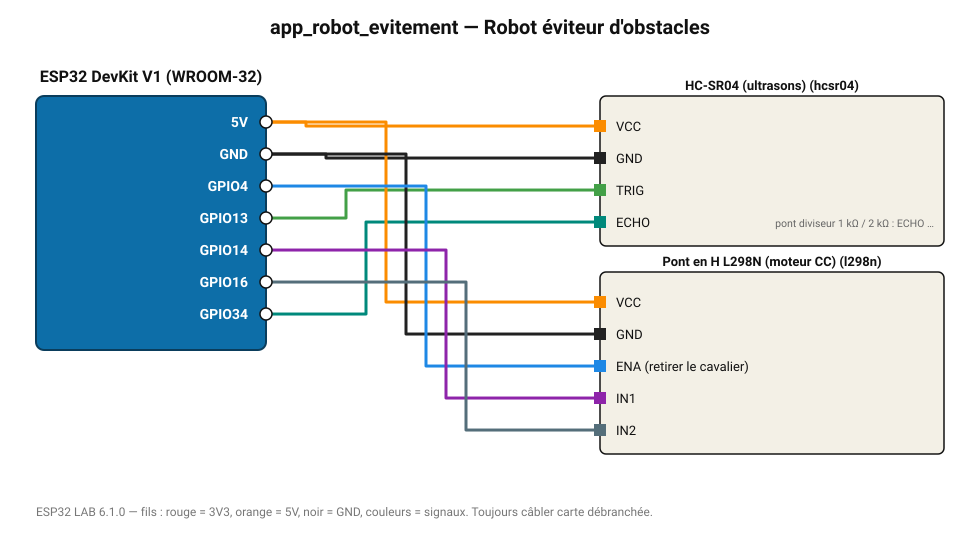

# Robot éviteur d'obstacles

Le moteur recule quand un obstacle est à moins de 20 cm, avance sinon (base de robot mobile).

**Carte :** ESP32 DevKit V1 (WROOM-32) — moniteur série 115200 bauds.

| ESP32 | Composant | Broche | Couleur fil | Remarque |
|---|---|---|---|---|
| 5V (VIN) | HC-SR04 (ultrasons) | VCC | orange |  |
| GND | HC-SR04 (ultrasons) | GND | noir |  |
| GPIO13 | HC-SR04 (ultrasons) | TRIG | vert |  |
| GPIO34 | HC-SR04 (ultrasons) | ECHO | turquoise | pont diviseur 1 kΩ / 2 kΩ : ECHO sort du 5 V |
| 5V (VIN) | Pont en H L298N (moteur CC) | VCC | orange |  |
| GND | Pont en H L298N (moteur CC) | GND | noir |  |
| GPIO4 | Pont en H L298N (moteur CC) | ENA (retirer le cavalier) | bleu |  |
| GPIO14 | Pont en H L298N (moteur CC) | IN1 | violet |  |
| GPIO16 | Pont en H L298N (moteur CC) | IN2 | gris-bleu |  |

> ⚠ Consommation de pointe estimée 1595 mA : prévoyez une alimentation externe 5 V (le port USB d'un PC fournit ~500 mA).
> ⚠ Alimentez Pont en H L298N (moteur CC) directement en 5 V externe et reliez les masses (GND commun).
> ⚠ HC-SR04 (ultrasons) : la broche ECHO délivre 5 V : utilisez un pont diviseur (1 kΩ / 2 kΩ) ou un convertisseur de niveau.

Toujours câbler **carte débranchée**. Masse (GND) commune entre tous les modules.
