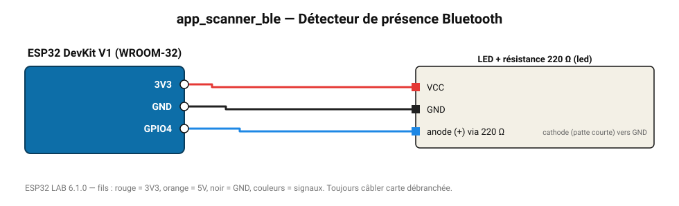

# Détecteur de présence Bluetooth

Compte les appareils BLE à proximité (téléphones, montres) ; LED allumée si l'un est très proche.

**Carte :** ESP32 DevKit V1 (WROOM-32) — moniteur série 115200 bauds.

| ESP32 | Composant | Broche | Couleur fil | Remarque |
|---|---|---|---|---|
| 3V3 | LED + résistance 220 Ω | VCC | rouge |  |
| GND | LED + résistance 220 Ω | GND | noir |  |
| GPIO4 | LED + résistance 220 Ω | anode (+) via 220 Ω | bleu | cathode (patte courte) vers GND |

Toujours câbler **carte débranchée**. Masse (GND) commune entre tous les modules.
