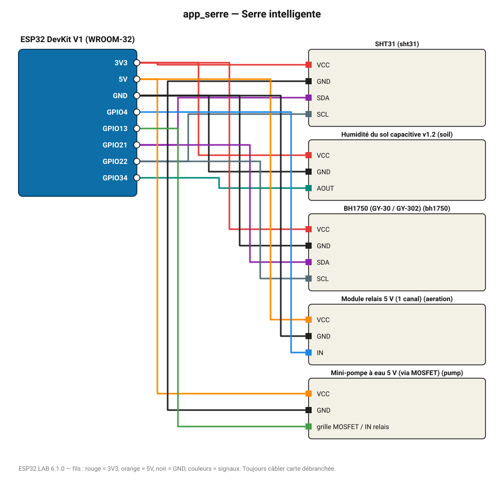

# Serre intelligente

Aération au-dessus de 28 °C, arrosage sous 35 % d'humidité du sol, suivi de la lumière ; tableau de bord web.

**Carte :** ESP32 DevKit V1 (WROOM-32) — moniteur série 115200 bauds.

| ESP32 | Composant | Broche | Couleur fil | Remarque |
|---|---|---|---|---|
| 3V3 | SHT31 | VCC | rouge |  |
| GND | SHT31 | GND | noir |  |
| GPIO21 | SHT31 | SDA | violet |  |
| GPIO22 | SHT31 | SCL | gris-bleu |  |
| 3V3 | Humidité du sol capacitive v1.2 | VCC | rouge |  |
| GND | Humidité du sol capacitive v1.2 | GND | noir |  |
| GPIO34 | Humidité du sol capacitive v1.2 | AOUT | turquoise |  |
| 3V3 | BH1750 (GY-30 / GY-302) | VCC | rouge |  |
| GND | BH1750 (GY-30 / GY-302) | GND | noir |  |
| GPIO21 | BH1750 (GY-30 / GY-302) | SDA | violet |  |
| GPIO22 | BH1750 (GY-30 / GY-302) | SCL | gris-bleu |  |
| 5V (VIN) | Module relais 5 V (1 canal) | VCC | orange |  |
| GND | Module relais 5 V (1 canal) | GND | noir |  |
| GPIO4 | Module relais 5 V (1 canal) | IN | bleu |  |
| 5V (VIN) | Mini-pompe à eau 5 V (via MOSFET) | VCC | orange |  |
| GND | Mini-pompe à eau 5 V (via MOSFET) | GND | noir |  |
| GPIO13 | Mini-pompe à eau 5 V (via MOSFET) | grille MOSFET / IN relais | vert |  |

> ⚠ Consommation de pointe estimée 733 mA : prévoyez une alimentation externe 5 V (le port USB d'un PC fournit ~500 mA).
> ⚠ Alimentez Mini-pompe à eau 5 V (via MOSFET) directement en 5 V externe et reliez les masses (GND commun).

Toujours câbler **carte débranchée**. Masse (GND) commune entre tous les modules.
