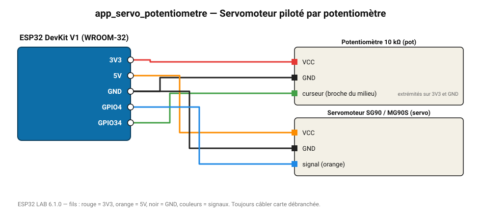

# Servomoteur piloté par potentiomètre

Le grand classique : l'angle du servo suit la position du potentiomètre.

**Carte :** ESP32 DevKit V1 (WROOM-32) — moniteur série 115200 bauds.

| ESP32 | Composant | Broche | Couleur fil | Remarque |
|---|---|---|---|---|
| 3V3 | Potentiomètre 10 kΩ | VCC | rouge |  |
| GND | Potentiomètre 10 kΩ | GND | noir |  |
| GPIO34 | Potentiomètre 10 kΩ | curseur (broche du milieu) | vert | extrémités sur 3V3 et GND |
| 5V (VIN) | Servomoteur SG90 / MG90S | VCC | orange |  |
| GND | Servomoteur SG90 / MG90S | GND | noir |  |
| GPIO4 | Servomoteur SG90 / MG90S | signal (orange) | bleu |  |

> ⚠ Consommation de pointe estimée 731 mA : prévoyez une alimentation externe 5 V (le port USB d'un PC fournit ~500 mA).
> ⚠ Alimentez Servomoteur SG90 / MG90S directement en 5 V externe et reliez les masses (GND commun).

Toujours câbler **carte débranchée**. Masse (GND) commune entre tous les modules.
