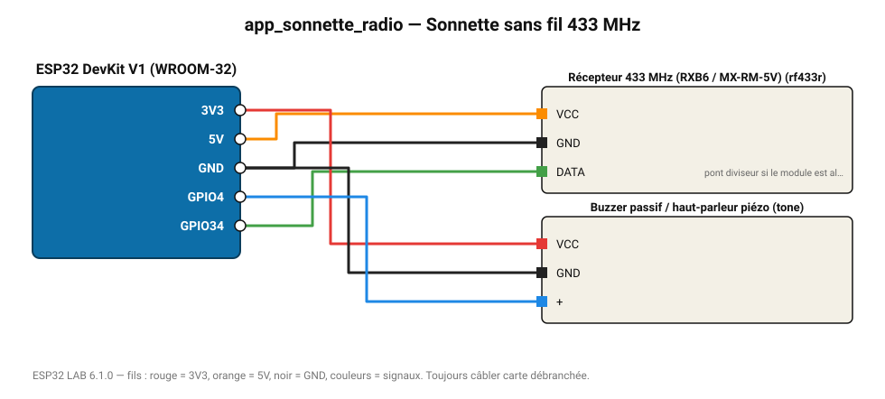

# Sonnette sans fil 433 MHz

Reconnaît le code d'un bouton de sonnette 433 MHz et joue une mélodie.

**Carte :** ESP32 DevKit V1 (WROOM-32) — moniteur série 115200 bauds.

| ESP32 | Composant | Broche | Couleur fil | Remarque |
|---|---|---|---|---|
| 5V (VIN) | Récepteur 433 MHz (RXB6 / MX-RM-5V) | VCC | orange |  |
| GND | Récepteur 433 MHz (RXB6 / MX-RM-5V) | GND | noir |  |
| GPIO34 | Récepteur 433 MHz (RXB6 / MX-RM-5V) | DATA | vert | pont diviseur si le module est alimenté en 5 V |
| 3V3 | Buzzer passif / haut-parleur piézo | VCC | rouge |  |
| GND | Buzzer passif / haut-parleur piézo | GND | noir |  |
| GPIO4 | Buzzer passif / haut-parleur piézo | + | bleu |  |

Toujours câbler **carte débranchée**. Masse (GND) commune entre tous les modules.
