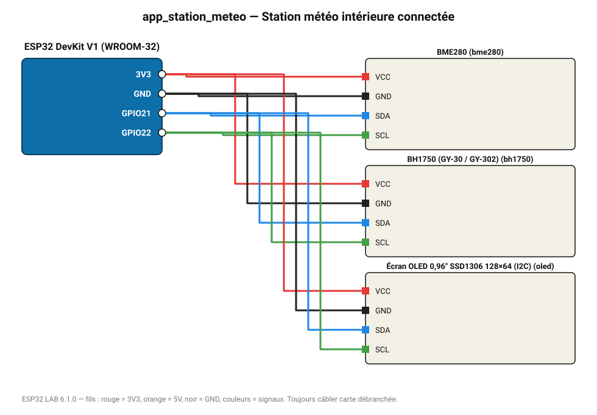

# Station météo intérieure connectée

Température, humidité, pression et luminosité sur écran OLED, page web locale et tableau de bord du MASTER.

**Carte :** ESP32 DevKit V1 (WROOM-32) — moniteur série 115200 bauds.

| ESP32 | Composant | Broche | Couleur fil | Remarque |
|---|---|---|---|---|
| 3V3 | BME280 | VCC | rouge |  |
| GND | BME280 | GND | noir |  |
| GPIO21 | BME280 | SDA | bleu |  |
| GPIO22 | BME280 | SCL | vert |  |
| 3V3 | BH1750 (GY-30 / GY-302) | VCC | rouge |  |
| GND | BH1750 (GY-30 / GY-302) | GND | noir |  |
| GPIO21 | BH1750 (GY-30 / GY-302) | SDA | bleu |  |
| GPIO22 | BH1750 (GY-30 / GY-302) | SCL | vert |  |
| 3V3 | Écran OLED 0,96" SSD1306 128×64 (I2C) | VCC | rouge |  |
| GND | Écran OLED 0,96" SSD1306 128×64 (I2C) | GND | noir |  |
| GPIO21 | Écran OLED 0,96" SSD1306 128×64 (I2C) | SDA | bleu |  |
| GPIO22 | Écran OLED 0,96" SSD1306 128×64 (I2C) | SCL | vert |  |

Toujours câbler **carte débranchée**. Masse (GND) commune entre tous les modules.
