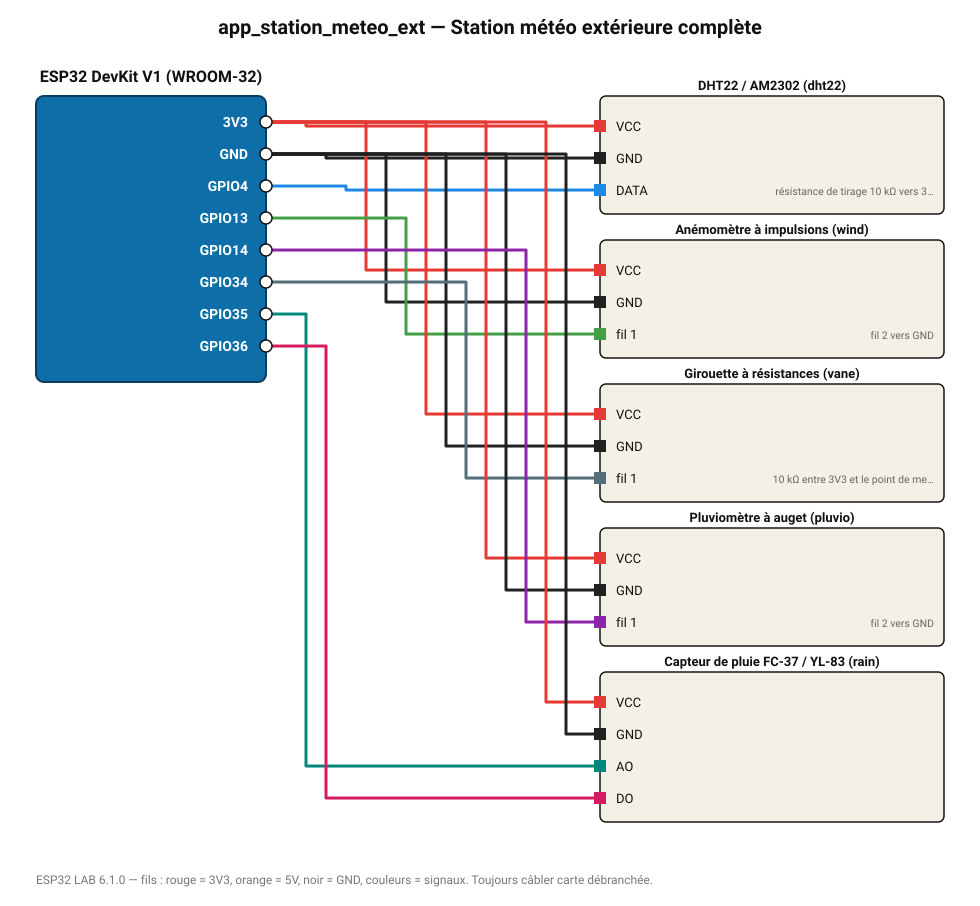

# Station météo extérieure complète

Kit météo : température/humidité, vitesse et direction du vent, cumul de pluie, détecteur de pluie, avec page web.

**Carte :** ESP32 DevKit V1 (WROOM-32) — moniteur série 115200 bauds.

| ESP32 | Composant | Broche | Couleur fil | Remarque |
|---|---|---|---|---|
| 3V3 | DHT22 / AM2302 | VCC | rouge |  |
| GND | DHT22 / AM2302 | GND | noir |  |
| GPIO4 | DHT22 / AM2302 | DATA | bleu | résistance de tirage 10 kΩ vers 3V3 (souvent déjà sur le module) |
| 3V3 | Anémomètre à impulsions | VCC | rouge |  |
| GND | Anémomètre à impulsions | GND | noir |  |
| GPIO13 | Anémomètre à impulsions | fil 1 | vert | fil 2 vers GND |
| 3V3 | Girouette à résistances | VCC | rouge |  |
| GND | Girouette à résistances | GND | noir |  |
| GPIO34 | Girouette à résistances | fil 1 | gris-bleu | 10 kΩ entre 3V3 et le point de mesure, fil 2 vers GND |
| 3V3 | Pluviomètre à auget | VCC | rouge |  |
| GND | Pluviomètre à auget | GND | noir |  |
| GPIO14 | Pluviomètre à auget | fil 1 | violet | fil 2 vers GND |
| 3V3 | Capteur de pluie FC-37 / YL-83 | VCC | rouge |  |
| GND | Capteur de pluie FC-37 / YL-83 | GND | noir |  |
| GPIO35 | Capteur de pluie FC-37 / YL-83 | AO | turquoise |  |
| GPIO36 | Capteur de pluie FC-37 / YL-83 | DO | rose |  |

Toujours câbler **carte débranchée**. Masse (GND) commune entre tous les modules.
