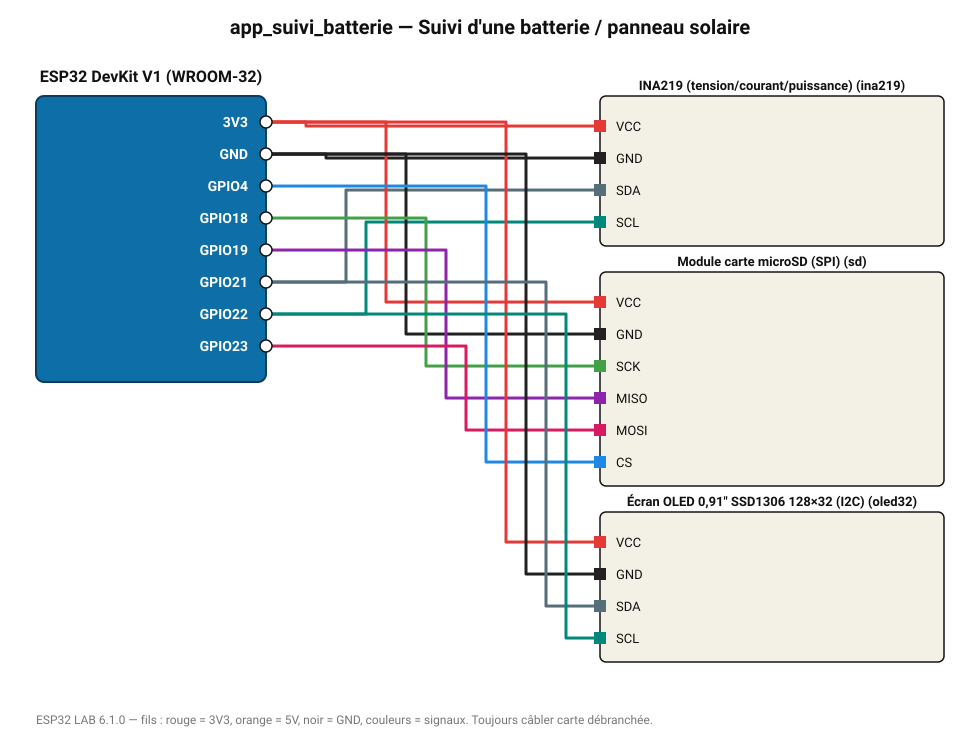

# Suivi d'une batterie / panneau solaire

Tension, courant et puissance mesurés par INA219, enregistrés sur carte SD.

**Carte :** ESP32 DevKit V1 (WROOM-32) — moniteur série 115200 bauds.

| ESP32 | Composant | Broche | Couleur fil | Remarque |
|---|---|---|---|---|
| 3V3 | INA219 (tension/courant/puissance) | VCC | rouge |  |
| GND | INA219 (tension/courant/puissance) | GND | noir |  |
| GPIO21 | INA219 (tension/courant/puissance) | SDA | gris-bleu |  |
| GPIO22 | INA219 (tension/courant/puissance) | SCL | turquoise |  |
| 3V3 | Module carte microSD (SPI) | VCC | rouge |  |
| GND | Module carte microSD (SPI) | GND | noir |  |
| GPIO18 | Module carte microSD (SPI) | SCK | vert |  |
| GPIO19 | Module carte microSD (SPI) | MISO | violet |  |
| GPIO23 | Module carte microSD (SPI) | MOSI | rose |  |
| GPIO4 | Module carte microSD (SPI) | CS | bleu |  |
| 3V3 | Écran OLED 0,91" SSD1306 128×32 (I2C) | VCC | rouge |  |
| GND | Écran OLED 0,91" SSD1306 128×32 (I2C) | GND | noir |  |
| GPIO21 | Écran OLED 0,91" SSD1306 128×32 (I2C) | SDA | gris-bleu |  |
| GPIO22 | Écran OLED 0,91" SSD1306 128×32 (I2C) | SCL | turquoise |  |

Toujours câbler **carte débranchée**. Masse (GND) commune entre tous les modules.
