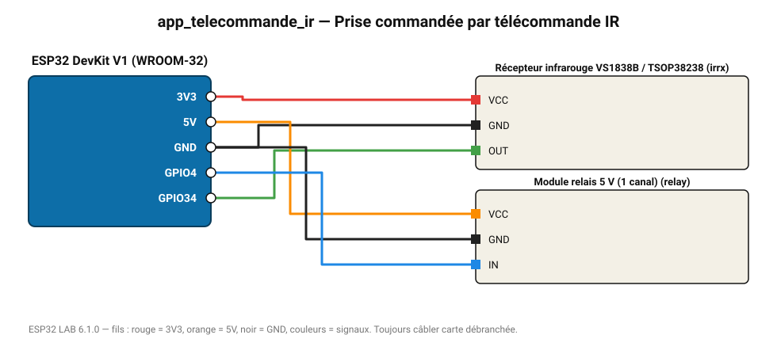

# Prise commandée par télécommande IR

La touche « 1 » (commande NEC 0x45) d'une télécommande allume le relais, toute autre touche l'éteint.

**Carte :** ESP32 DevKit V1 (WROOM-32) — moniteur série 115200 bauds.

| ESP32 | Composant | Broche | Couleur fil | Remarque |
|---|---|---|---|---|
| 3V3 | Récepteur infrarouge VS1838B / TSOP38238 | VCC | rouge |  |
| GND | Récepteur infrarouge VS1838B / TSOP38238 | GND | noir |  |
| GPIO34 | Récepteur infrarouge VS1838B / TSOP38238 | OUT | vert |  |
| 5V (VIN) | Module relais 5 V (1 canal) | VCC | orange |  |
| GND | Module relais 5 V (1 canal) | GND | noir |  |
| GPIO4 | Module relais 5 V (1 canal) | IN | bleu |  |

Toujours câbler **carte débranchée**. Masse (GND) commune entre tous les modules.
