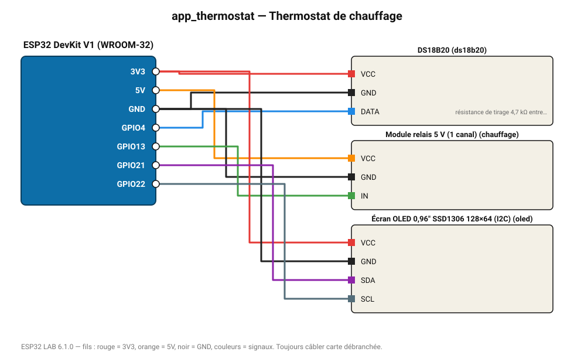

# Thermostat de chauffage

Enclenche un radiateur (via relais) sous 19 °C avec hystérésis de 0,5 °C ; affichage OLED.

**Carte :** ESP32 DevKit V1 (WROOM-32) — moniteur série 115200 bauds.

| ESP32 | Composant | Broche | Couleur fil | Remarque |
|---|---|---|---|---|
| 3V3 | DS18B20 | VCC | rouge |  |
| GND | DS18B20 | GND | noir |  |
| GPIO4 | DS18B20 | DATA | bleu | résistance de tirage 4,7 kΩ entre DATA et 3V3 obligatoire |
| 5V (VIN) | Module relais 5 V (1 canal) | VCC | orange |  |
| GND | Module relais 5 V (1 canal) | GND | noir |  |
| GPIO13 | Module relais 5 V (1 canal) | IN | vert |  |
| 3V3 | Écran OLED 0,96" SSD1306 128×64 (I2C) | VCC | rouge |  |
| GND | Écran OLED 0,96" SSD1306 128×64 (I2C) | GND | noir |  |
| GPIO21 | Écran OLED 0,96" SSD1306 128×64 (I2C) | SDA | violet |  |
| GPIO22 | Écran OLED 0,96" SSD1306 128×64 (I2C) | SCL | gris-bleu |  |

Toujours câbler **carte débranchée**. Masse (GND) commune entre tous les modules.
