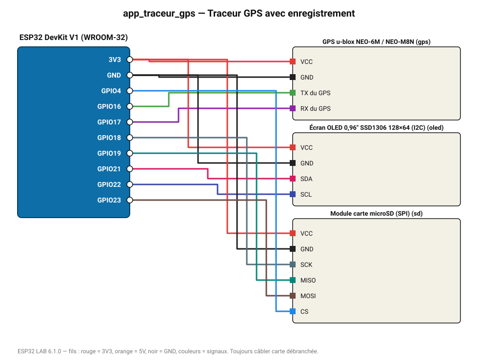

# Traceur GPS avec enregistrement

Position, altitude et vitesse enregistrées sur microSD et affichées sur OLED.

**Carte :** ESP32 DevKit V1 (WROOM-32) — moniteur série 115200 bauds.

| ESP32 | Composant | Broche | Couleur fil | Remarque |
|---|---|---|---|---|
| 3V3 | GPS u-blox NEO-6M / NEO-M8N | VCC | rouge |  |
| GND | GPS u-blox NEO-6M / NEO-M8N | GND | noir |  |
| GPIO16 | GPS u-blox NEO-6M / NEO-M8N | TX du GPS | vert |  |
| GPIO17 | GPS u-blox NEO-6M / NEO-M8N | RX du GPS | violet |  |
| 3V3 | Écran OLED 0,96" SSD1306 128×64 (I2C) | VCC | rouge |  |
| GND | Écran OLED 0,96" SSD1306 128×64 (I2C) | GND | noir |  |
| GPIO21 | Écran OLED 0,96" SSD1306 128×64 (I2C) | SDA | rose |  |
| GPIO22 | Écran OLED 0,96" SSD1306 128×64 (I2C) | SCL | indigo |  |
| 3V3 | Module carte microSD (SPI) | VCC | rouge |  |
| GND | Module carte microSD (SPI) | GND | noir |  |
| GPIO18 | Module carte microSD (SPI) | SCK | gris-bleu |  |
| GPIO19 | Module carte microSD (SPI) | MISO | turquoise |  |
| GPIO23 | Module carte microSD (SPI) | MOSI | marron |  |
| GPIO4 | Module carte microSD (SPI) | CS | bleu |  |

Toujours câbler **carte débranchée**. Masse (GND) commune entre tous les modules.
