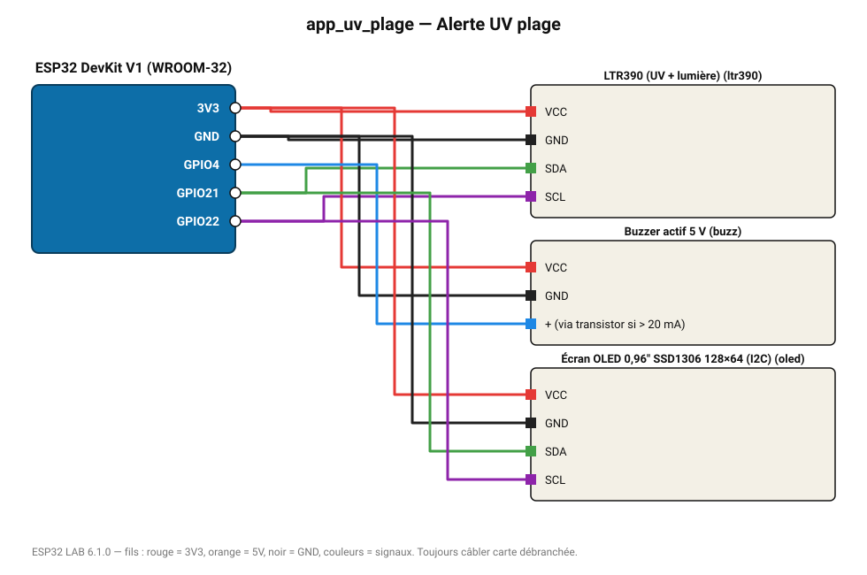

# Alerte UV plage

Indice UV sur OLED et bip au-dessus de l'indice 6 (protection solaire).

**Carte :** ESP32 DevKit V1 (WROOM-32) — moniteur série 115200 bauds.

| ESP32 | Composant | Broche | Couleur fil | Remarque |
|---|---|---|---|---|
| 3V3 | LTR390 (UV + lumière) | VCC | rouge |  |
| GND | LTR390 (UV + lumière) | GND | noir |  |
| GPIO21 | LTR390 (UV + lumière) | SDA | vert |  |
| GPIO22 | LTR390 (UV + lumière) | SCL | violet |  |
| 3V3 | Buzzer actif 5 V | VCC | rouge |  |
| GND | Buzzer actif 5 V | GND | noir |  |
| GPIO4 | Buzzer actif 5 V | + (via transistor si > 20 mA) | bleu |  |
| 3V3 | Écran OLED 0,96" SSD1306 128×64 (I2C) | VCC | rouge |  |
| GND | Écran OLED 0,96" SSD1306 128×64 (I2C) | GND | noir |  |
| GPIO21 | Écran OLED 0,96" SSD1306 128×64 (I2C) | SDA | vert |  |
| GPIO22 | Écran OLED 0,96" SSD1306 128×64 (I2C) | SCL | violet |  |

Toujours câbler **carte débranchée**. Masse (GND) commune entre tous les modules.
