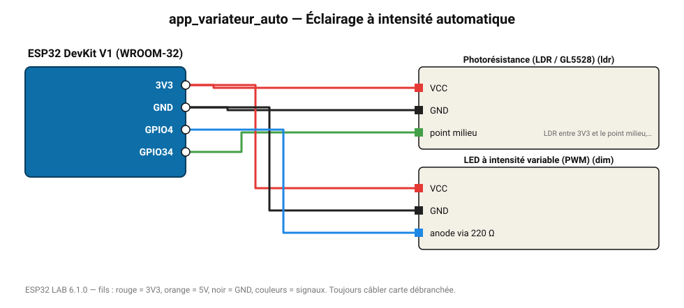

# Éclairage à intensité automatique

Une LED/ruban compense la lumière ambiante : plus il fait sombre, plus elle éclaire.

**Carte :** ESP32 DevKit V1 (WROOM-32) — moniteur série 115200 bauds.

| ESP32 | Composant | Broche | Couleur fil | Remarque |
|---|---|---|---|---|
| 3V3 | Photorésistance (LDR / GL5528) | VCC | rouge |  |
| GND | Photorésistance (LDR / GL5528) | GND | noir |  |
| GPIO34 | Photorésistance (LDR / GL5528) | point milieu | vert | LDR entre 3V3 et le point milieu, 10 kΩ entre le point milieu et GND |
| 3V3 | LED à intensité variable (PWM) | VCC | rouge |  |
| GND | LED à intensité variable (PWM) | GND | noir |  |
| GPIO4 | LED à intensité variable (PWM) | anode via 220 Ω | bleu |  |

Toujours câbler **carte débranchée**. Masse (GND) commune entre tous les modules.
