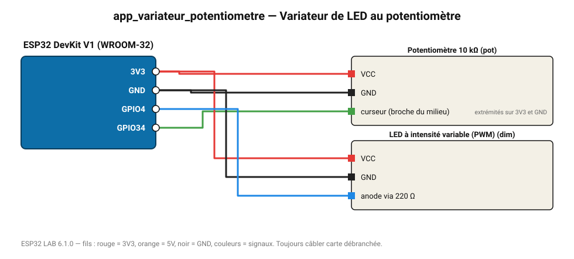

# Variateur de LED au potentiomètre

La luminosité de la LED suit le potentiomètre (PWM avec correction de perception).

**Carte :** ESP32 DevKit V1 (WROOM-32) — moniteur série 115200 bauds.

| ESP32 | Composant | Broche | Couleur fil | Remarque |
|---|---|---|---|---|
| 3V3 | Potentiomètre 10 kΩ | VCC | rouge |  |
| GND | Potentiomètre 10 kΩ | GND | noir |  |
| GPIO34 | Potentiomètre 10 kΩ | curseur (broche du milieu) | vert | extrémités sur 3V3 et GND |
| 3V3 | LED à intensité variable (PWM) | VCC | rouge |  |
| GND | LED à intensité variable (PWM) | GND | noir |  |
| GPIO4 | LED à intensité variable (PWM) | anode via 220 Ω | bleu |  |

Toujours câbler **carte débranchée**. Masse (GND) commune entre tous les modules.
