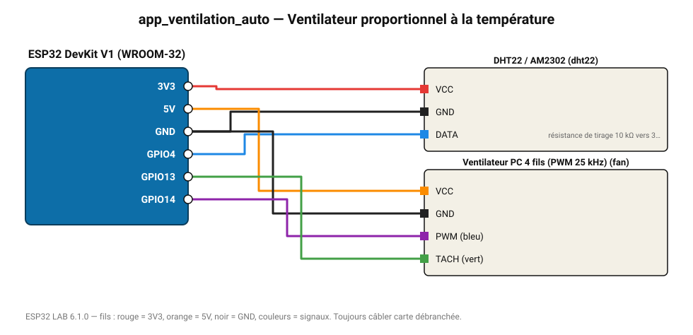

# Ventilateur proportionnel à la température

La vitesse du ventilateur 4 fils suit la température : 20 % à 22 °C, 100 % à 32 °C.

**Carte :** ESP32 DevKit V1 (WROOM-32) — moniteur série 115200 bauds.

| ESP32 | Composant | Broche | Couleur fil | Remarque |
|---|---|---|---|---|
| 3V3 | DHT22 / AM2302 | VCC | rouge |  |
| GND | DHT22 / AM2302 | GND | noir |  |
| GPIO4 | DHT22 / AM2302 | DATA | bleu | résistance de tirage 10 kΩ vers 3V3 (souvent déjà sur le module) |
| 5V (VIN) | Ventilateur PC 4 fils (PWM 25 kHz) | VCC | orange |  |
| GND | Ventilateur PC 4 fils (PWM 25 kHz) | GND | noir |  |
| GPIO14 | Ventilateur PC 4 fils (PWM 25 kHz) | PWM (bleu) | violet |  |
| GPIO13 | Ventilateur PC 4 fils (PWM 25 kHz) | TACH (vert) | vert |  |

Toujours câbler **carte débranchée**. Masse (GND) commune entre tous les modules.
