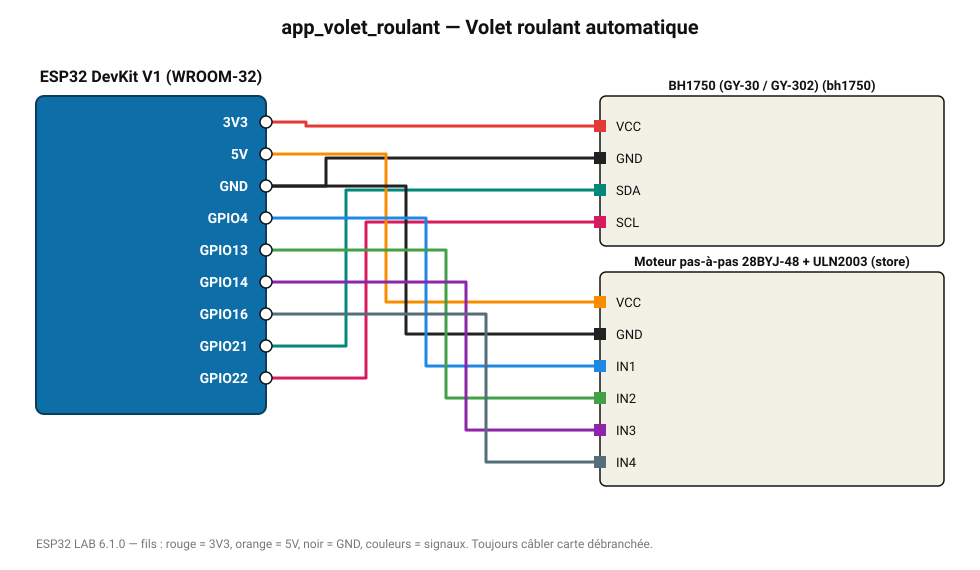

# Volet roulant automatique

Ouvre un store (moteur pas-à-pas) au-dessus de 2000 lx et le referme la nuit.

**Carte :** ESP32 DevKit V1 (WROOM-32) — moniteur série 115200 bauds.

| ESP32 | Composant | Broche | Couleur fil | Remarque |
|---|---|---|---|---|
| 3V3 | BH1750 (GY-30 / GY-302) | VCC | rouge |  |
| GND | BH1750 (GY-30 / GY-302) | GND | noir |  |
| GPIO21 | BH1750 (GY-30 / GY-302) | SDA | turquoise |  |
| GPIO22 | BH1750 (GY-30 / GY-302) | SCL | rose |  |
| 5V (VIN) | Moteur pas-à-pas 28BYJ-48 + ULN2003 | VCC | orange |  |
| GND | Moteur pas-à-pas 28BYJ-48 + ULN2003 | GND | noir |  |
| GPIO4 | Moteur pas-à-pas 28BYJ-48 + ULN2003 | IN1 | bleu |  |
| GPIO13 | Moteur pas-à-pas 28BYJ-48 + ULN2003 | IN2 | vert |  |
| GPIO14 | Moteur pas-à-pas 28BYJ-48 + ULN2003 | IN3 | violet |  |
| GPIO16 | Moteur pas-à-pas 28BYJ-48 + ULN2003 | IN4 | gris-bleu |  |

> ⚠ Alimentez Moteur pas-à-pas 28BYJ-48 + ULN2003 directement en 5 V externe et reliez les masses (GND commun).

Toujours câbler **carte débranchée**. Masse (GND) commune entre tous les modules.
