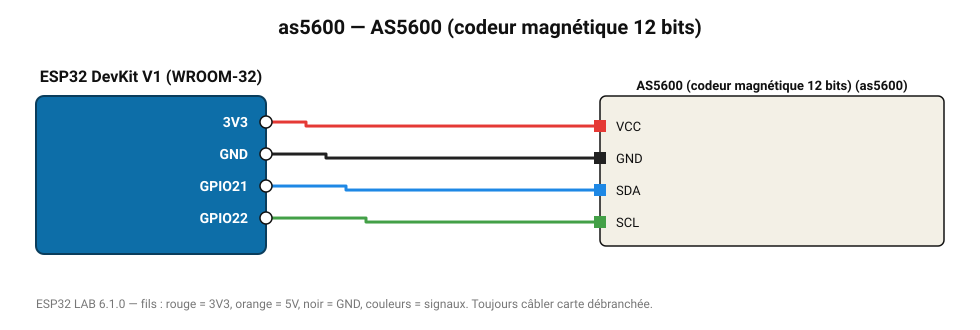

# AS5600 (codeur magnétique 12 bits)

Mesure l'angle absolu d'un aimant diamétral (0-360°, 4096 pas) sans contact.

**Carte :** ESP32 DevKit V1 (WROOM-32) — moniteur série 115200 bauds.

| ESP32 | Composant | Broche | Couleur fil | Remarque |
|---|---|---|---|---|
| 3V3 | AS5600 (codeur magnétique 12 bits) | VCC | rouge |  |
| GND | AS5600 (codeur magnétique 12 bits) | GND | noir |  |
| GPIO21 | AS5600 (codeur magnétique 12 bits) | SDA | bleu |  |
| GPIO22 | AS5600 (codeur magnétique 12 bits) | SCL | vert |  |

Toujours câbler **carte débranchée**. Masse (GND) commune entre tous les modules.
